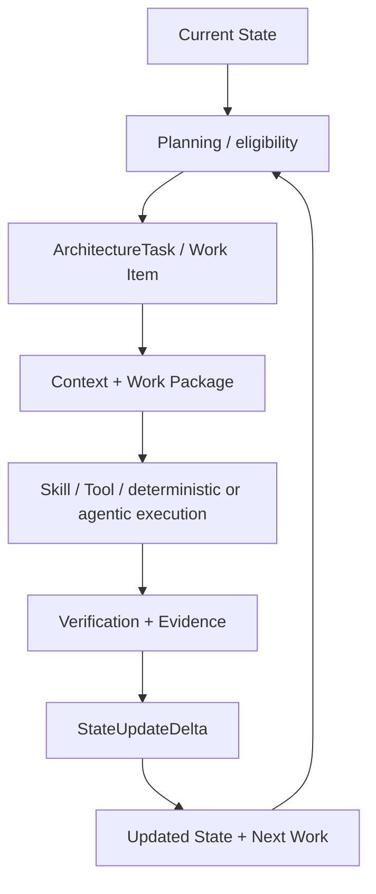
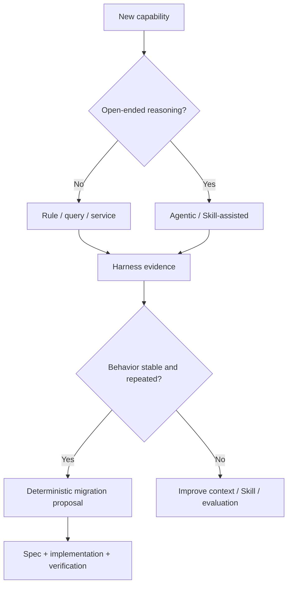

# 58 — Operating Model, Loop/Harness & Spec Expansion Contract

## Control

| Campo | Valor |
|---|---|
| `artifact_id` | `HAPPY-KNOW-58` |
| `status` | `DRAFT` |
| `delivery_status` | `PREPARED_NOT_DELIVERED` |
| `operating_scope` | Seed V1 behavior contract; not runtime implementation |
| `planning_sprint_status` | `BOUNDARY_ONLY / SER-010` |

## Work Model V1



| Stage | Governing artifacts | Required output | Prohibited shortcut |
|---|---|---|---|
| Current State | Seed manifest, baseline, decisions, Specs, evidence | versioned reconciled state | derive truth from chat/session memory |
| Planning/eligibility | capability graph, dependencies, 0009/0037 boundary | eligible/blocked Work Items and rationale | invent full Sprint or priority weights |
| Task/Work Item | 0009 | durable identity, owner, criteria, blockers | identify work only by prompt text |
| Context/Work Package | 0005 | purpose-scoped immutable package/manifest | send entire uncontrolled corpus |
| Capability selection | 0015/0017/0019/0035 + policy | deterministic/Skill/Tool/agentic/hybrid route | assume reported capability is available |
| Execution | delegation + 0006 | structured result/attempt/receipts | grant institutional authority to LLM |
| Verification | 0020–0023/0029 | pass/fail/blocked evidence | treat artifact or written test as success |
| State update | 0004/0008/0009/0010 | optimistic, evidence-linked delta | silent status elevation or overwrite |
| Replanning | dependency model + gaps | next eligible work or Decision Package | demand a new numbered prompt/wave |

## Target Operating Model

El modelo futuro conserva las invariantes del Work Model V1 y puede incorporar:

- Planning/Sprint completo cuando `SER-010` permita reconciliarlo;
- dependency graph y automatic planning con explainable eligibility;
- multi-agent/parallel work con isolation y merge/conflict control;
- evaluation harness y conformance checks;
- operational observability, budgets and cost optimization;
- deterministic services para behavior estable;
- ML sólo con baseline, dataset, policy and promotion;
- country/capability/provider knowledge and research loops;
- local-to-central execution bajo triggers verificables.

No existe un target que autorice un agent runtime u orchestration engine que replique a Devin.

### Maturity and adoption profiles

The non-linear target path is `SEED → BOOTSTRAP_TRUST → BUILDER_READY → SELF_KNOWLEDGE_READY → DOCUMENTATION_READY → INGESTION_READY → ENVIRONMENT_AWARE → DELIVERY_ALM_AWARE → ARCHITECT_READY → MULTI_ARCHITECT_READY → CHIEF_OR_DOMAIN_READY → FEDERATED_ORGANIZATION`. Stages may advance in parallel where dependencies allow; no stage is promoted without its mandatory evidence.

Adoption readiness is a governed claim, not an LLM opinion: `READINESS_PROFILE + REQUIRED_CRITERIA + EVIDENCE → PASS/PARTIAL/FAIL → RECOMMENDATION`. Profiles may distinguish builder, controlled pilot, limited architect rollout, architect rollout, Chief/domain operation and federation. They share one canonical model but have different required evidence; no percentage is invented.

Capability discovery, reachability, configuration, authorization, verification, operational readiness, user readiness, adoptability and federation/scale readiness remain separate observations. Access or credentials do not authorize production mutation.

### Institutional delivery discovery and portfolio steering

Before introducing a deployment path, follow `DISCOVER → UNDERSTAND → MODEL → COMPARE → REUSE → EXTEND_IF_NEEDED` for existing Git/CI/ALM/pipeline/policy capabilities. Never bypass an institutional delivery path because direct platform access exists.

Humans steer intent, priority, authority, strategic constraints, risk acceptance and irreducible decisions. Architecture AI translates accepted demand into impact, capability/spec delta, dependencies, eligible Work Items, parallel execution candidates, verification and state updates. Known future branches remain visible but inactive until selected by the current maturity target and eligibility rules.

## Work-model evolution rules

`OBSERVED_LIMITATION → EVIDENCE → IMPACT → PROPOSED_MODEL_CHANGE → COMPATIBILITY/MIGRATION → VERIFICATION → APPROVAL → NEW_VERSION`.

Toda evolución:

1. conserva IDs, provenance y state history;
2. identifica Work Items, Skills/Tools, events, schemas y tests afectados;
3. distingue cambio del modelo de cambio en implementación;
4. ofrece migration/rollback cuando rompe compatibilidad;
5. no reabre decisiones congeladas silenciosamente;
6. compara behavior previo/nuevo mediante fixtures y receipts.

## Context Engineering

`Context Engineering` decide qué información necesita una ejecución y por qué.

Incluye scope/purpose, sources, evidence, decisions, Specs, country, permissions, freshness, conflicts, must-not-infer, budgets, reason-for-inclusion, Work Package y Context Manifest.

Estado: `DESIGN_COVERED_HIGH` por 0005/0007/0008/0020/0024/0025, pero retrieval/index/runtime y restart proof permanecen parciales.

## Harness Engineering

`Harness Engineering` controla cómo se ejecuta, observa, evalúa y verifica una capability. No se reduce a tests.

| Harness concern | Existing roots | Target behavior | Status |
|---|---|---|---|
| checks/policy | 0006/0022/0028 | pre/post action checks and approvals | design; enforcement unverified |
| fixtures/regression | 0022/0023 | reproducible golden cases across versions | partial; corpus absent |
| verification/evidence | 0009/0010/0020/0029 | receipts linked to criteria/result/baseline | draft contracts; no run |
| reproducibility | bootstrap/test strategy | same inputs/version produce comparable state/outcome | not proven |
| metrics/comparison | 0019/0029 | compare iterations, cost, quality, latency and failure | partial |
| repeated failure | 0018/0019/0029 | detect patterns; stop blind retries; create diagnosis/work | discovered |
| stable behavior detection | 0019/0029 | propose Skill/Tool/service/rule migration | discovered |
| conformance | 0021/0022 | architecture/code/spec/runtime consistency | discovered |

Estado: `TARGET_DEFINED / IMPLEMENTATION_NOT_AUTHORIZED`.

## Loop Engineering

`Loop Engineering` usa result/failure/evidence de una iteración para seleccionar la siguiente acción correcta.

`Objective → Context → Devin/LLM → Skills/Tools/Services → Harness/Evaluation → Result/Failure → Diagnosis → Evidence → State/Context Adjustment, Retry or Escalation → Next Iteration`.

Reglas:

- loop continuity no depende de una agent/session instance;
- retry exige changed condition, new evidence, bounded attempt or explicit backoff; no `retry/retry/retry` ciego;
- todo loop tiene progress/exit/escalation criteria y budgets;
- result no modifica canonical state sin reconciliation/promotion;
- cada evolución del loop se valida contra iteration evidence;
- semántica de process/case/decision se investiga contra BPMN/CMMN/DMN antes de custom engine.

Estado: `TRANSVERSAL_CAPABILITY_PROPOSAL / RESEARCH_REQUIRED`.

## Human interaction as exception path

Ruta normal: continuación autónoma gobernada. Antes de `HUMAN_DECISION_REQUIRED`, el sistema consulta, cuando aplique:

1. existing decision;
2. existing Spec;
3. invariant;
4. target/capability model;
5. prior rationale/rejected alternative;
6. standards/frameworks;
7. evidence/governed knowledge;
8. internal research;
9. permitted external research;
10. supported inference con status y limits.

No se pregunta al humano para reconstruir conocimiento recuperable o una decisión ya cerrada. Inference no puede sustituir policy/authority.

### Decision Package contract candidate

```yaml
decisionPackageId: DP-<generated>
decisionNeeded: <one precise decision>
whyHumanIsRequired: <typed gate>
currentState: <versioned state ref>
knownContext: <context/work-package refs>
evidence: []
options: []
recommendedOption: null
impact:
  capabilities: []
  specs: []
  implementation: []
risks: []
reversibility: <assessment>
authorityRequired: <role/owner or UNKNOWN>
resumeTrigger: <receipt/evidence/decision>
```

El schema no se formaliza en 3C. La recomendación no es aprobación. Si authority es desconocida, se registra source gap.

## Deterministic / Agentic / Skill / Tool / ML evolution

### Routing questions

1. ¿La salida se obtiene por regla, query, cálculo o transformación estable? → deterministic.
2. ¿Hay un procedimiento repetible que combina contexto y herramientas? → Skill candidate.
3. ¿Se necesita side effect o acceso estructurado? → Tool/service bajo policy.
4. ¿Se necesita juicio/síntesis abierta? → Devin/agentic con Work Package y Harness.
5. ¿Existe patrón predictivo medible con dataset aprobado? → ML candidate sólo después de baseline no-AI.
6. ¿Se combinan reglas, retrieval, model y human gate? → hybrid.

### Evolution lifecycle



ML hierarchy candidate: deterministic → query/calculation → statistics → optimization → ML → deep learning → LLM → agentic. `ML DETECTS; POLICY DECIDES.`

No capability migra sólo por costo o repetición: debe mantener calidad, seguridad, provenance, observability and rollback.

## Agent / role evolution

### Roles/capabilities already discussed

| Role/candidate agent | Objective | Current state | Required capability roots | Evolution directions |
|---|---|---|---|---|
| Devin Coordinator | reasoning/planning/execution | external runtime, sessions/capabilities source-gated | context, Task, Skills/Tools, policy, Harness | coordination changes without institutional authority |
| Ingestion | collect/parse/delta sources | partial design/report | 0007/0023/0032 | split by adapter; deterministic parsing; quality gates |
| Documenter | Arc42/C4/Mermaid and narratives | design/reported docs | 0034, knowledge, rendering | specialize by view; deterministic regeneration |
| Publisher | governed PR/publication | design | 0004/0012/0034 | Confluence/Git adapters; approval separation |
| Knowledge Control | classify/reconcile/promote | design | 0004/0007/0024/0025 | alias/entity resolution; human correction |
| Cost Monitor | tokens/cost/quality | design | 0029 | FinOps optimization and budgets |
| Security/Vulnerability | threats/CVEs/standards/risk proposals | design | 0018/0027/0028/0033 | threat projection; deterministic watches |
| Planning/Retest | planning, dependencies, verification cycles | historical detail partial | 0009/0018/0022/0029/0037 | richer planning after SER-010; not custom agent runtime |
| Notification | Teams/Outlook awareness | design/capability unverified | 0006/0018/0032 | routing and human attention policies |
| DBA/platform specialties | store/migration/operation advice | roles mentioned; exact agents unknown | 0026/0030/0031 | may remain human/service/Skill depending evidence |

Agent IDs, exact Skills/Tools and active runtime identities remain `BLOCKED_BY_SOURCE(SER-002/004/005/009)`. Evolution can split, merge, specialize, remove, extract Skill or move to deterministic service only through evidence→impact→proposal→verification→canonical version.

## Spec Expansion Contract

### Chain

`Capability → Requirement → Decision → Specification → Implementation → Test → Evidence`.

### Pre-create search order

1. existing Spec;
2. existing capability;
3. decision/invariant/constraint;
4. rejected alternative or known future direction;
5. standard/framework/library/corporate capability;
6. overlapping profile/registry/policy/directive/contract;
7. only then extend or create a Spec.

### Expansion output

Toda expansión conserva:

- stable IDs/version/provenance;
- source statements and rationale;
- current vs target state/maturity;
- decisions, rejected alternatives and unknowns;
- dependencies/enables/blocked_by;
- standards/adoption status;
- cross-cutting applicability;
- interfaces/states/failure modes/observability;
- acceptance criteria/tests/evidence;
- migration/compatibility/rollback;
- human authority and promotion gate.

### New Spec gate

Una Spec independiente sólo se justifica si existe un contrato/lifecycle/interface/authority materialmente autónomo que no pueda modelarse sin ambigüedad como extensión, profile, registry, policy, directive o composed standard. La asignación de ID ocurre después de dedup/standards analysis.

## State after 3C

| Model | Estado |
|---|---|
| Work Model V1 | `DRAFT_COVERED` |
| Target Operating Model | `DIRECTION_VISIBLE / NOT_FROZEN` |
| Work-model evolution | `DRAFT_COVERED` |
| Context Engineering | `DESIGN_COVERED_HIGH / RUNTIME_PARTIAL` |
| Harness Engineering | `TARGET_DEFINED / NOT_IMPLEMENTED` |
| Loop Engineering | `PROPOSAL / RESEARCH_REQUIRED` |
| Human exception path | `DERIVED_INVARIANT / NOT_PROVEN` |
| Spec Expansion Contract | `DRAFT_COVERED` |

## 3E federated operating extension

El Work Model V1 no cambia. Se añade un contexto de dominio antes de modificar una capability organizacional:

`OBSERVE_WITH_PERMISSION → MODEL_CURRENT_REALITY → RECONCILE_WITH_DNA/STANDARDS → CLASSIFY_VARIANT/GAP/CONFLICT → PROPOSE → SHADOW/ASSIST → VERIFY → AUTHORIZED_PROMOTION`.

Reglas:

1. `visibility/discovery/knowledge` nunca asignan ownership o authority;
2. una práctica local distinta puede ser una variante justificada o evidencia de un modelo central incompleto;
3. knowledge domain→central pasa por 0007/0004, no por auto-promoción;
4. automation possibility produce candidate, no readiness ni permiso de cambio;
5. domain-specific UX/context son projections del mismo modelo gobernado;
6. conflicto material persistente produce Decision Package a la autoridad real;
7. cambios organizacionales y human-value transitions permanecen proposal/authority-gated.

## Deterministic maturity extension

Las formas `MANUAL`, `AGENT_ASSISTED`, `AGENTIC`, `HYBRID` y `DETERMINISTIC` describen opciones de ejecución, no una escalera obligatoria. La selección depende de reasoning need, rule stability, risk, exceptions, evidence y authority. Una migración exige Harness comparison, shadow result, security/audit/operations checks, rollback y approval.

## Assurance extension

La salida del Harness sólo soporta promotion cuando existe una cadena `CLAIM → ARGUMENT/RATIONALE → EVIDENCE`, con counterevidence/conflicts visibles. Se reutilizan los estados `DISCOVERED/INFERRED/VALIDATED/APPROVED`; no se añade un estado paralelo. SACM/GSN y otros estándares se investigan antes de custom semantics.

## Post-handoff expansion obligations

El contrato ejecutable futuro está indexado en `82_DEVIN_EXPANSION_OBLIGATIONS.md`. Work conserva el objetivo, authority boundary, dependencies, ROs y acceptance; Devin expande contracts/code/tests sólo después de bootstrap/reconciliation y autorización.

## Acceptance extension — realization, assurance and objective preservation

`AGENT != CAPABILITY`. Before creating or retaining an Agent, the expansion path evaluates whether the capability is better realized by a rule, validator, job, workflow, deterministic service, Skill, Tool, Agent, hybrid composition or human authority. Responsibilities and capability identity survive implementation-form changes.

Reasoning may be agentic. Substantiation is deterministic where technically possible. A material hypothesis follows `HYPOTHESIS → PROPOSED → TESTED → VALIDATED → PROMOTED`; no transition is inferred from narrative confidence.

Known objectives are not deleted when branches evolve. Their lifecycle is recorded as `ACTIVE`, `EXPANDED`, `MERGED`, `SUPERSEDED`, `DEFERRED`, `REJECTED` or `BLOCKED`, or mapped to an existing equivalent state with provenance. New branches follow `DISCOVER → CORRELATE → DEDUPLICATE → CLASSIFY → EVALUATE → ACCEPT/DEFER/REJECT`.

The documentation and ingestion visible milestones are acceptance targets, not implementation claims. Their expansion and tests are linked in documents 70, 75, 81 and 82.
