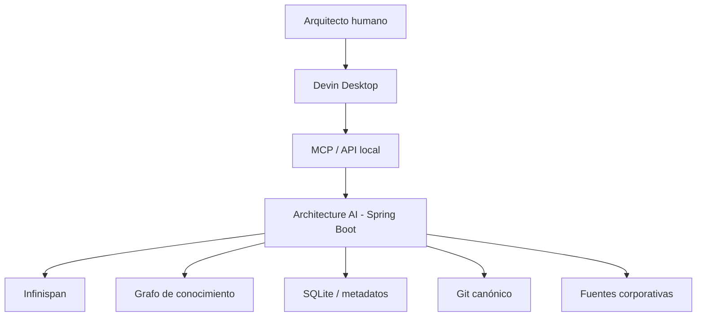

# 02 — Arquitectura

## Vista de contexto



## Componentes lógicos

- Context Resolution: arma contexto mínimo suficiente y explicable.
- Work Package Builder: produce el contrato de ejecución por taskId.
- Knowledge Service: entidades, hechos, fuentes, confianza y temporalidad.
- Graph Service: relaciones y consultas de impacto/dependencia.
- Projection Manager: vistas locales derivadas de Git y fuentes.
- Ingestion: parsing, normalización, chunking, delta e indexación.
- Governance: ADR, riesgos, validación, aprobación y auditoría.
- Git Canonical Repository: promoción por commit/PR.
- Scheduler: refrescos y mantenimiento determinístico.
- Evaluation: pruebas de recuperación, calidad y groundedness.
- Integration Adapters: Devin, Confluence, Outlook, Teams y repositorios.
- Desktop Extension: captura intención y presenta estado; delega razonamiento.

## Projection Manager

Estados: `EMPTY`, `LOADING`, `READY`, `STALE`, `UPDATING`, `DEGRADED`, `FAILED`.

El refresco desde Git debe ser incremental, observable, reiniciable e idempotente. Una proyección degradada debe conservar la última versión válida e indicar antigüedad y causa.

## Contrato de tarea

```yaml
taskId: AAI-0001
objective: resultado observable
intent: analyze|design|document|validate|publish
scope: inclusiones y exclusiones
solutionContext: solución o componente
constraints: restricciones aplicables
baseline: commit, versión y estado
facts: hechos verificados
knowledge: referencias resueltas
adrs: decisiones aplicables
standards: normas y lineamientos
reviewCriteria: criterios humanos
evidence: fuentes y fragmentos
risks: riesgos conocidos
unknowns: dudas y contradicciones
forbiddenActions: acciones prohibidas
expectedOutput: artefactos esperados
verificationCriteria: comprobaciones ejecutables
```

## Flujo principal

1. Capturar intención y generar taskId.
2. Resolver contexto y clasificar confianza.
3. Preparar Work Package.
4. Ejecutar en Devin o capacidad determinística según necesidad.
5. Verificar salidas y vincular evidencia.
6. Someter cambios institucionales a revisión.
7. Promover a Git y actualizar proyecciones/grafo.

