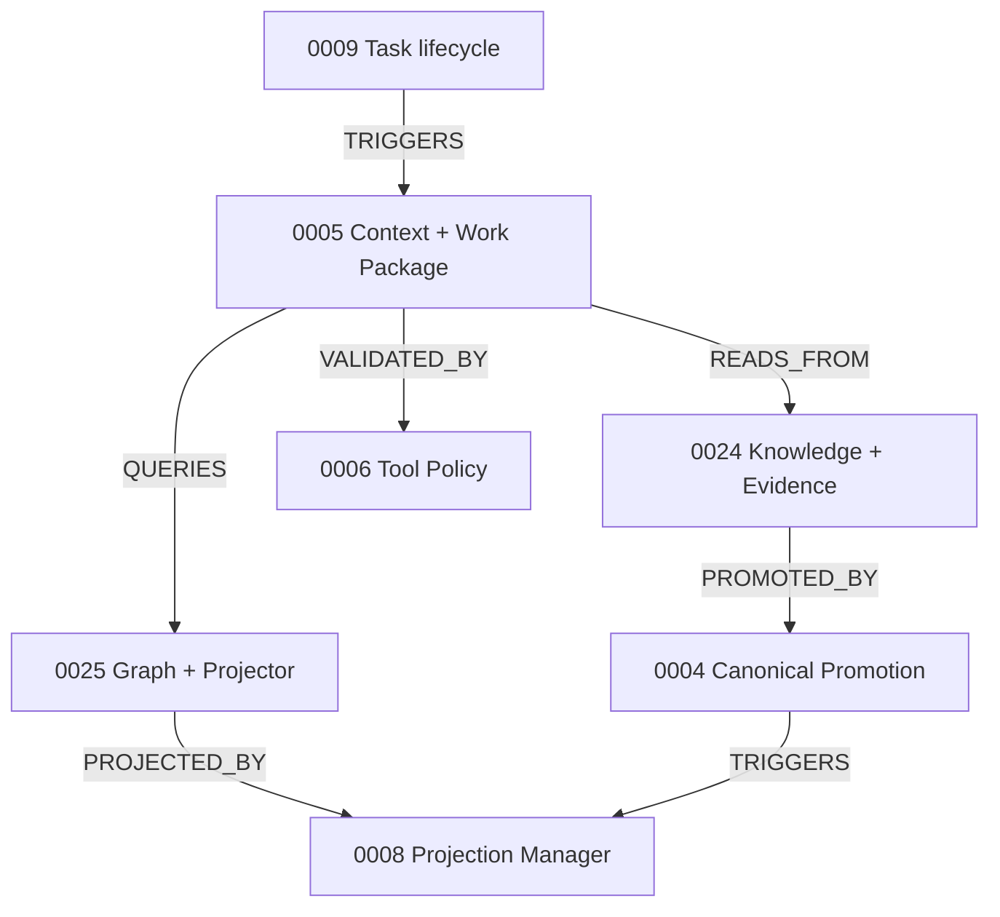
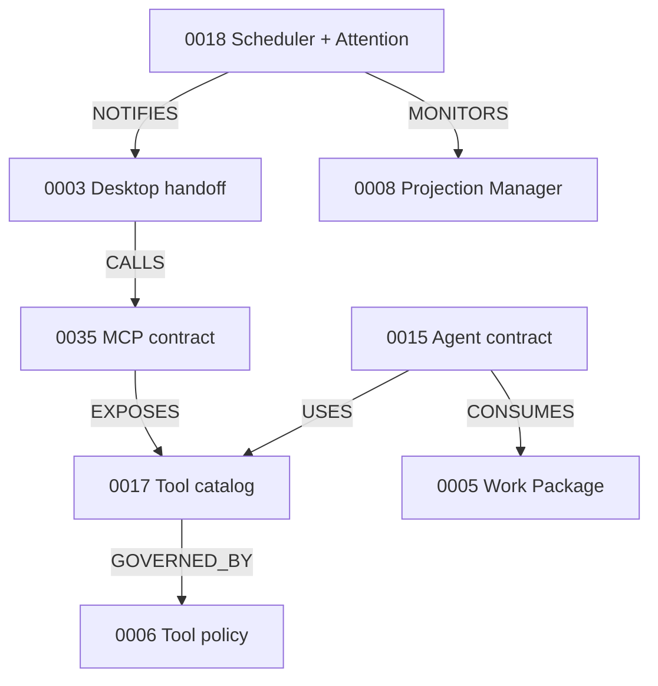
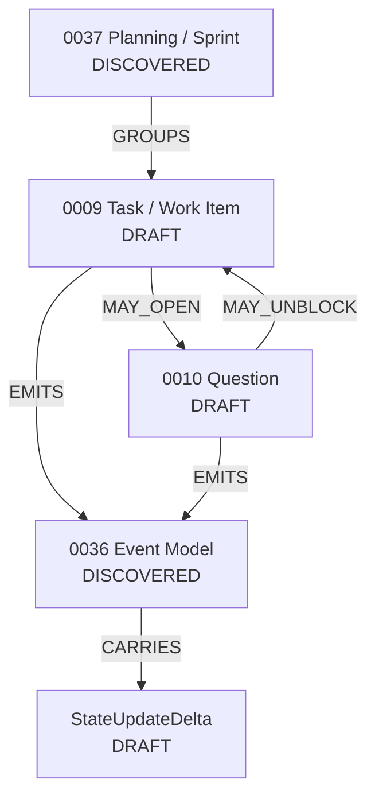
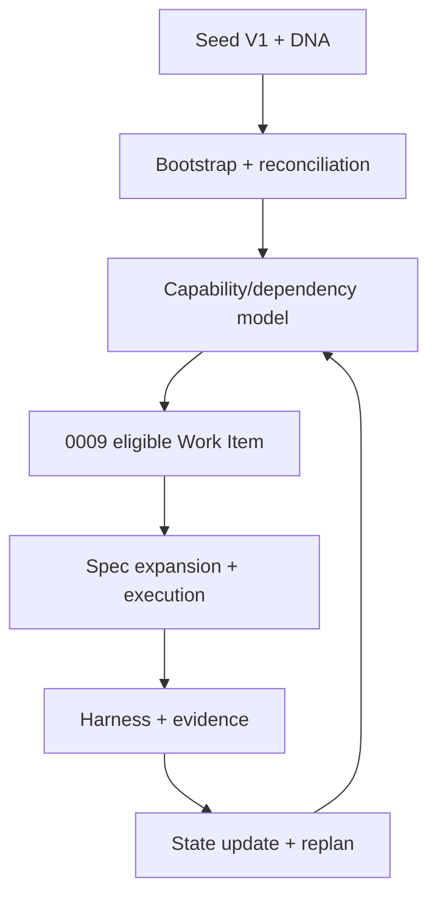

# 23 — Specification Relationship Map

## Propósito

Este mapa convierte el catálogo en una red navegable. Una relación no implica que ambos extremos estén implementados; el status se consulta en `22_SPECIFICATION_CATALOG.md` y `26_CURRENT_IMPLEMENTATION_BASELINE.md`.

## Núcleo de contexto y conocimiento

## Agente, MCP y operación

## Work lifecycle, questions y estado verificable

`0036` no queda formalizada por este diagrama: únicamente recibe contratos lifecycle provisionales; transport, topics, ordering, delivery, retry y outbox siguen bloqueados por fuente.

## Seed V1, capabilities y expansión

La Seed es una vista/paquete de knowledge bootstrap; no se convierte en una Spec monolítica ni en runtime. Capability edges se detallan en `57_CAPABILITY_DEPENDENCY_AND_AUTONOMY_CRITICAL_PATH.md`.

## Relación canónica spec-to-spec

| Relation ID | Source spec | Relación | Target spec / objeto | Explicación | Evidence source |
|---|---|---|---|---|---|
| REL-0001 | AAI-SPEC-0001 | PROVIDES_CONTEXT_TO | AAI-SPEC-0005 | Bootstrap alimenta resolución por país/plataforma | Wave 1 specs |
| REL-0002 | AAI-SPEC-0002 | GOVERNS | AAI-SPEC-0021 | Review debe cubrir vectores interrelacionados | Wave 1 Spec 0002 |
| REL-0003 | AAI-SPEC-0003 | CALLS | AAI-SPEC-0035 | Desktop usa MCP/API; no lógica local | Prompt 00 |
| REL-0004 | AAI-SPEC-0003 | TRIGGERS | AAI-SPEC-0009 | UI crea/abre/entrega Architecture Task | Prompt 00 |
| REL-0005 | AAI-SPEC-0003 | CONSUMES | AAI-SPEC-0008 | Muestra readiness/health de proyección | Prompt 00 |
| REL-0006 | AAI-SPEC-0004 | CONSUMES | AAI-SPEC-0007 | Sólo candidato reconciliado llega a promoción | DOC-0501 |
| REL-0007 | AAI-SPEC-0004 | WRITES_TO | Git canonical | PR/commit gobernado precede proyección | Frozen decision |
| REL-0008 | AAI-SPEC-0004 | TRIGGERS | AAI-SPEC-0008 | Commit aprobado actualiza proyecciones | Prompt 00 |
| REL-0009 | AAI-SPEC-0004 | GOVERNED_BY | AAI-SPEC-0006 | Policy + approval para cambio material | DOC-0601 |
| REL-0010 | AAI-SPEC-0005 | READS_FROM | AAI-SPEC-0024 | Recupera facts/evidence/decisions | Prompt 00 |
| REL-0011 | AAI-SPEC-0005 | QUERIES | AAI-SPEC-0025 | Recupera relaciones, impacto y contradicción | DOC-0503 |
| REL-0012 | AAI-SPEC-0005 | USES | AAI-SPEC-0006 | Filtrado antes/después de retrieval | DOC-0503 |
| REL-0013 | AAI-SPEC-0005 | PRODUCES | ArchitectureWorkPackage | Contrato inmutable por taskId | Prompt 00 |
| REL-0014 | AAI-SPEC-0005 | VALIDATED_BY | AAI-SPEC-0020 | Assurance y abstention | Prompt 00 |
| REL-0015 | AAI-SPEC-0007 | USES | AAI-SPEC-0023 | Parsing/benchmark controla calidad | Prompt 00 |
| REL-0016 | AAI-SPEC-0007 | PRODUCES | AAI-SPEC-0024 | Source/Evidence/Claim/Candidate | DOC-0501 |
| REL-0017 | AAI-SPEC-0007 | WRITES_TO | AAI-SPEC-0025 discovered | Relaciones tentativas, no canónicas | Graph conversation |
| REL-0018 | AAI-SPEC-0007 | TRIGGERS | AAI-SPEC-0004 | Candidato reconciliado puede proponerse | DOC-0501 |
| REL-0019 | AAI-SPEC-0008 | PERSISTS_IN | AAI-SPEC-0026 | Checkpoints/read models/caches | DOC-0307 |
| REL-0020 | AAI-SPEC-0008 | PRODUCES | readiness events | Attention/consumers observan estado | Prompt 00 |
| REL-0021 | AAI-SPEC-0009 | TRIGGERS | AAI-SPEC-0005 | Una tarea compleja necesita contexto | Prompt 00 |
| REL-0022 | AAI-SPEC-0009 | USES | AAI-SPEC-0012 | Issue/branch/PR cuando hay cambio gobernado | Prompt 00 |
| REL-0023 | AAI-SPEC-0009 | GOVERNED_BY | AAI-SPEC-0015 | Ownership y structured outputs | Prompt 00 |
| REL-0024 | AAI-SPEC-0010 | ROUTES_TO | AAI-SPEC-0016 | Gap se dirige a expert/formal owner | Prompt 00 |
| REL-0025 | AAI-SPEC-0010 | MAY_CREATE | AAI-SPEC-0009 | Respuesta puede producir task/ADR/risk | Prompt 00 |
| REL-0026 | AAI-SPEC-0011 | USES | AAI-SPEC-0002 | Triage considera vectores e impacto | Prompt 00 |
| REL-0027 | AAI-SPEC-0011 | PRODUCES | AAI-SPEC-0009 | Resultado crea task o no-action | Prompt 00 |
| REL-0028 | AAI-SPEC-0012 | GOVERNS | AAI-SPEC-0013 | Overlap semántico por solution/change | Prompt 00 |
| REL-0029 | AAI-SPEC-0012 | USES | AAI-SPEC-0008 | Fetch/projection current antes de cambio | Prompt 00 |
| REL-0030 | AAI-SPEC-0013 | VERSIONED_BY | AAI-SPEC-0014 | Solution/baseline/delta no son sólo documento | Prompt 00 |
| REL-0031 | AAI-SPEC-0013 | REVIEWED_BY | AAI-SPEC-0021 | Impact manifest alimenta review | Prompt 00 |
| REL-0032 | AAI-SPEC-0015 | CONSUMES | AAI-SPEC-0005 | Workers reciben Work Package acotado | Prompt 00 |
| REL-0033 | AAI-SPEC-0015 | USES | AAI-SPEC-0017 | Skill/tool son capacidades, no roles | Prompt 00 |
| REL-0034 | AAI-SPEC-0015 | GOVERNED_BY | AAI-SPEC-0006 | Allowed tools y protected artifacts | Prompt 00 |
| REL-0035 | AAI-SPEC-0016 | USES | AAI-SPEC-0024 | Expertise observado no reemplaza ownership | Prompt 00 |
| REL-0036 | AAI-SPEC-0017 | EXPOSED_BY | AAI-SPEC-0035 | Tools institucionales vía MCP | Prompt 00 |
| REL-0037 | AAI-SPEC-0017 | GOVERNED_BY | AAI-SPEC-0006 | Cada tool tiene policy class | DOC-0601 |
| REL-0038 | AAI-SPEC-0018 | MONITORS | AAI-SPEC-0008 | Projection freshness/health | Prompt 00 |
| REL-0039 | AAI-SPEC-0018 | NOTIFIES | AAI-SPEC-0003 | Badge/view/notification según severidad | Prompt 00 |
| REL-0040 | AAI-SPEC-0018 | TRIGGERS | AAI-SPEC-0009 | Job/watch puede generar task | Prompt 00 |
| REL-0041 | AAI-SPEC-0019 | MONITORS | AAI-SPEC-0015 | Detecta reasoning repetido | Prompt 00 |
| REL-0042 | AAI-SPEC-0019 | CONFIGURES | AAI-SPEC-0017 | Evoluciona skill→tool→Java service | Prompt 00 |
| REL-0043 | AAI-SPEC-0020 | VALIDATES | AAI-SPEC-0005 | Supported/partial/conflicted/insufficient | Prompt 00 |
| REL-0044 | AAI-SPEC-0021 | USES | AAI-SPEC-0002 | Revisión multi-vector | Prompt 00 |
| REL-0045 | AAI-SPEC-0021 | USES | AAI-SPEC-0022 | Checks determinísticos primero | Prompt 00 |
| REL-0046 | AAI-SPEC-0021 | PRODUCES | findings/risks/questions | Salidas estructuradas | Prompt 00 |
| REL-0047 | AAI-SPEC-0022 | TESTS | AAI-SPEC-0006 | Auth/classification/evidence rules | Prompt 00 |
| REL-0048 | AAI-SPEC-0023 | TESTS | AAI-SPEC-0007 | Golden documents y parser quality | Prompt 00 |
| REL-0049 | AAI-SPEC-0024 | PROJECTED_IN | AAI-SPEC-0025 | Entidades/claims como grafo | DOC-0501/0502 |
| REL-0050 | AAI-SPEC-0025 | PERSISTS_VIA | AAI-SPEC-0026 | Adapter JanusGraph/Neo4j | DOC-0307 |
| REL-0051 | AAI-SPEC-0027 | GOVERNS | AAI-SPEC-0021 | Findings→risk→treatment/acceptance | Prompt 00 |
| REL-0052 | AAI-SPEC-0028 | SECURES | AAI-SPEC-0003 | Desktop trust boundary | DOC-0601 |
| REL-0053 | AAI-SPEC-0028 | SECURES | AAI-SPEC-0035 | MCP identity/auth/tool boundary | DOC-0601 |
| REL-0054 | AAI-SPEC-0029 | MONITORS | AAI-SPEC-0005 | latency/retrieval/groundedness/cost | Prompt 00 |
| REL-0055 | AAI-SPEC-0029 | MONITORS | AAI-SPEC-0018 | job/freshness/misfires | Prompt 00 |
| REL-0056 | AAI-SPEC-0030 | DEPLOYS | AAI-SPEC-0003 | Desktop integration | Project context |
| REL-0057 | AAI-SPEC-0030 | DEPLOYS | local Spring Boot/MCP | Instalador desde Git, role-aware goal | Project context |
| REL-0058 | AAI-SPEC-0031 | SUPERSEDES_BY_EVOLUTION | AAI-SPEC-0026 local adapters | Mantiene domain contracts | DOC-0302/0307 |
| REL-0059 | AAI-SPEC-0032 | CONFIGURES | external adapters | Sólo tras capability discovery | Prompt 00 |
| REL-0060 | AAI-SPEC-0033 | PRODUCES | ExternalObligation/Interpretation/Control | No auto-convierte a standard | Prompt 00 |
| REL-0061 | AAI-SPEC-0034 | USES | AAI-SPEC-0012 | Git/PR/review/publication | Prompt 00 |
| REL-0062 | AAI-SPEC-0035 | ROUTES_TO | AAI-SPEC-0017 | Validación, ejecución y error | MCP architecture |
| REL-0063 | AAI-SPEC-0036 | CORRELATES | task/projection/ingestion flows | taskId/requestId/idempotency | Prompt 00 |
| REL-0064 | AAI-SPEC-0037 | PART_OF | Planning capability | Sprint es modelo de gestión, no Agent ni Spring Boot | User alignment directive |
| REL-0065 | AAI-SPEC-0037 | PRODUCES | AAI-SPEC-0009 Work Items | Sprint agrupa/ordena unidades ejecutables | User alignment + Prompt 00 |
| REL-0066 | AAI-SPEC-0037 | USES | AAI-SPEC-0005 | Cada Work Item complejo recibe Work Package versionado | User alignment + frozen boundary |
| REL-0067 | AAI-SPEC-0037 | ASSIGNS_TO | AAI-SPEC-0015 | El contrato del agente limita ownership/tools/output | Prompt 00 |
| REL-0068 | AAI-SPEC-0037 | GOVERNED_BY | AAI-SPEC-0006 | Work/Tools respetan policy y approvals | Security architecture |
| REL-0069 | AAI-SPEC-0037 | SCHEDULES_WITH | AAI-SPEC-0018 | Fechas/watches/misfires son operación determinística | Prompt 00 |
| REL-0070 | AAI-SPEC-0037 | MONITORED_BY | AAI-SPEC-0029 | Evidencia, throughput, blockages y outcomes | User alignment |
| REL-0071 | AAI-SPEC-0019 | EVOLVES | SKILL / TOOL / SERVICE | Evolución gobernada, no cambio arbitrario | Prompt 00 + user alignment |
| REL-0072 | AAI-SPEC-0037 | TRIGGERS | AAI-SPEC-0022 | Work completado exige test/verificación/evidencia | User alignment |
| REL-0073 | AAI-SPEC-0009 | CONSUMES | AAI-SPEC-0005 | Work Item complejo usa Work Package versionado y autorizado | Prompt 00 + Spec 0009 |
| REL-0074 | AAI-SPEC-0009 | GOVERNED_BY | AAI-SPEC-0006 | Inicio, Tools, side effects y transitions protegidas respetan policy | Security design + Spec 0009 |
| REL-0075 | AAI-SPEC-0009 | DELEGATES_TO | AAI-SPEC-0015 | Delegación limita actor, scope, expiración y output contract | Agent operating model + Spec 0009 |
| REL-0076 | AAI-SPEC-0009 | MAY_OPEN | AAI-SPEC-0010 | Gap indispensable crea pregunta enlazada, no una suposición | Prompt 00 + Spec 0009 |
| REL-0077 | AAI-SPEC-0009 | VERIFIED_BY | AAI-SPEC-0022 | Cierre requiere acceptance/test/evidence correspondiente | User alignment + Spec 0009 |
| REL-0078 | AAI-SPEC-0009 | MONITORED_BY | AAI-SPEC-0029 | State, blockages, attempts, latency y evidence son observables | Agent operating model + Spec 0009 |
| REL-0079 | AAI-SPEC-0009 | PRODUCES | AAI-SPEC-0036 lifecycle events | Eventos DRAFT se envuelven con task/correlation/causation/idempotency | Prompt 00 + Spec 0009 |
| REL-0080 | AAI-SPEC-0010 | MAY_BLOCK | AAI-SPEC-0009 | Pregunta indispensable puede llevar la tarea a espera/bloqueo explícito | Prompt 00 + Spec 0010 |
| REL-0081 | AAI-SPEC-0010 | ROUTES_VIA | AAI-SPEC-0016 | Expertise ayuda a enrutar; formal responsibility conserva autoridad | DOC-0105 + Spec 0010 |
| REL-0082 | AAI-SPEC-0010 | VALIDATED_BY | AAI-SPEC-0020 | Answer Assurance impide resolver sin soporte suficiente | Prompt 00 + Spec 0010 |
| REL-0083 | AAI-SPEC-0010 | MAY_TRIGGER | AAI-SPEC-0007/0004 | Documento o knowledge candidate puede ingresar/reconciliarse; promoción sigue su gate | Prompt 00 + Spec 0010 |
| REL-0084 | AAI-SPEC-0010 | MAY_PRODUCE | ADR / RISK / TASK | Outcomes crean artefactos separados y trazables, nunca aprobación implícita | Prompt 00 + Spec 0010 |
| REL-0085 | AAI-SPEC-0010 | PRODUCES | AAI-SPEC-0036 lifecycle events | Eventos DRAFT correlacionan question/task sin fijar transport | Prompt 00 + Spec 0010 |
| REL-0086 | AAI-SPEC-0036 | ENVELOPES | WorkLifecycleEvent / QuestionLifecycleEvent | Envelope provisional común conserva provenance, actor, sequence e idempotency | Specs 0009/0010; conditioned by SER-002 |
| REL-0087 | StateUpdateDelta | REALIZES | AAI-SPEC-0009/0010 transitions | Delta exige previous/new state, reason, actor, evidence y optimistic version | Specs 0009/0010 |
| REL-0088 | Bootstrap skeleton | SELECTS_NEXT | AAI-SPEC-0009 Work Item | Sólo elige trabajo elegible bajo gates; no materializa Sprint completo | User Oleada 3B directive |
| REL-0089 | Seed V1 | INCLUDES | Architectural DNA | North Star, canonical/derived/proposed invariants and constraints | P-WAVE-3C-01; HAPPY-KNOW-55 |
| REL-0090 | Seed V1 | USES | Initial Knowledge Model | Layers/vectors are an evolvable bootstrap classification | P-WAVE-3C-01; HAPPY-KNOW-56 |
| REL-0091 | Seed V1 | INCLUDES | Target Capability Map | Current/target/maturity/dependencies/future intent remain visible | P-WAVE-3C-01; HAPPY-KNOW-54/56 |
| REL-0092 | Target Capability Map | CORRELATED_BY | Capability Dependency Graph | Enables critical-path and eligible-work reasoning | HAPPY-KNOW-57 |
| REL-0093 | Bootstrap skeleton | CONSUMES | Seed V1 | Clean session reads manifest/DNA/capabilities/specs/state/gaps | P-WAVE-3C-01; HAPPY-BOOT-0002 |
| REL-0094 | Bootstrap skeleton | PRODUCES | BootstrapReceipt proposal | Receipt captures assets, repo/runtime, capabilities, blockers and next work | HAPPY-BOOT-0002; HAPPY-KNOW-61 |
| REL-0095 | AAI-SPEC-0009 | REALIZES | Durable Work Continuity | Work outlives Conversation/User/Agent/Devin sessions | AAI-SPEC-0009 v0.2; P-WAVE-3C-01 |
| REL-0096 | WorkSession | ADVANCES | AAI-SPEC-0009 Task/Work Item | One resumable work window can contain multiple executions | AAI-SPEC-0009 v0.2 |
| REL-0097 | AgentSession / DevinSession | PARTICIPATES_IN | Execution | Runtime instance is ephemeral; responsibility/state remain durable | AAI-SPEC-0009 v0.2 |
| REL-0098 | ContextManifest | REFERENCES | AAI-SPEC-0005 Work Package | Manifest records loaded sources/versions/permissions/gaps; does not replace AWP | AAI-SPEC-0009 v0.2 |
| REL-0099 | Checkpoint | ENABLES | Resume | Resume validates version/baseline/permissions/dependencies before work | AAI-SPEC-0009 v0.2 |
| REL-0100 | Handoff | CARRIES | ContextManifest + Checkpoint | Transfer preserves owner, constraints, partial outputs and blockers | AAI-SPEC-0009 v0.2 |
| REL-0101 | Conversation | PROVIDES_EVIDENCE_VIA | AAI-SPEC-0007 | Conversation is source/evidence after ingestion; not WorkSession or authority | AAI-SPEC-0009 v0.2; 0007 |
| REL-0102 | Loop Engineering capability | USES | AAI-SPEC-0009/0010 | Iterations produce/resolve work and questions without agent-owned continuity | HAPPY-KNOW-52/58 |
| REL-0103 | Loop Engineering capability | EVALUATED_BY | AAI-SPEC-0022/0029 | Progress, failures, budgets and comparison require Harness/evidence | HAPPY-KNOW-58 |
| REL-0104 | Loop Engineering capability | GOVERNED_BY | AAI-SPEC-0006/0027 | Allowed actions, approvals and risk gates precede promotion | HAPPY-KNOW-58 |
| REL-0105 | Loop Engineering capability | MAY_PRODUCE | AAI-SPEC-0036 event candidates | Event names/transport are deferred until 0036/source/standards gate | HAPPY-KNOW-53; BLOCKED_BY_SOURCE |
| REL-0106 | Model Evolution capability | GOVERNED_BY | AAI-SPEC-0004/0014 | New model version needs impact, migration, verification and approval | HAPPY-KNOW-56 |
| REL-0107 | Target Capability Map | GUIDES | AAI-SPEC-0037 | Capability/dependency state informs Planning; full Sprint stays SER-010 | HAPPY-KNOW-57/58 |
| REL-0108 | Corporate Capability Discovery | PRECEDES | AAI-SPEC-0032 | Available providers/constraints are checked before new technology | HAPPY-KNOW-52/54 |
| REL-0109 | Software Architecture Profile candidate | COMPOSES | AAI-SPEC-0021/0022/0034 | Logical model, Java modules, executable rules, static analysis and views | HAPPY-KNOW-53/62 |
| REL-0110 | Consistency/Conformance capability | VALIDATES | AAI-SPEC-0008/0014/0021/0022 | Projection/baseline/design/code/runtime are not assumed congruent | HAPPY-KNOW-52/54/57 |
| REL-0111 | Research Engineering capability | PRODUCES | AAI-SPEC-0024 Evidence | Predefined criteria, sources, conflicts and reproducibility precede conclusion | HAPPY-KNOW-58/62 |
| REL-0112 | Technology Lifecycle capability | TRIGGERS | AAI-SPEC-0018/0019/0030 work | LTS/EOL/CVE/license/baseline changes create evaluated work, not automatic upgrade | HAPPY-KNOW-59 |
| REL-0113 | Country Architecture Profile candidate | PROVIDES_CONTEXT_TO | AAI-SPEC-0001/0005 | Shared platform intelligence remains separated from country truth | HAPPY-KNOW-52/56 |
| REL-0114 | Threat Model Projection candidate | DERIVED_FROM | AAI-SPEC-0013/0028 | Architecture assets/flows/trust boundaries project to threats/controls/risks/evidence | HAPPY-KNOW-52/62 |
| REL-0115 | AI Use Case Registry candidate | GOVERNED_BY | AAI-SPEC-0006/0027/0029 | Non-AI baseline/evaluation/policy required before promotion | HAPPY-KNOW-54/58/62 |
| REL-0116 | Documentation Projection capability | USES | Git canonical + AAI-SPEC-0008/0034 | Author/version once; render/publish derived views with receipts | HAPPY-KNOW-52/60 |
| REL-0117 | Bootstrap staging repository | TRANSPORTS | Seed V1 | Personal public staging is clone/ZIP transport, not implementation authority | P-WAVE-3C-01; HAPPY-KNOW-60 |
| REL-0118 | Seed V1 cutover | BOOTSTRAPS | Devin + organizational repo | Post-handoff continuous evolution authority moves to governed implementation repo | HAPPY-KNOW-60 |
| REL-0119 | Prompt/Wave history | BECOMES | Non-orchestrating provenance | Post-cutover work is driven by Task/Planning/capabilities/state/evidence | P-WAVE-3C-01; HAPPY-KNOW-60 |
| REL-0120 | SEED-ACCEPT-001 | TESTS | Bootstrap/0009/expansion/state loop | Clean sessions must reconcile and select equivalent next work without prompt sequence | HAPPY-KNOW-61 |
| REL-0121 | Seed root | NAVIGATES_TO | DNA + capabilities + Specs + baseline + gaps | Root is compact; deep detail remains linked and authoritative by status | HAPPY-KNOW-67/69; AAI-DEC-0024 |
| REL-0122 | Semantic deduplication | PRESERVES | Specs 0001–0037 + aliases/history | No new Spec ID in 3D; overlap is classified, not deleted | HAPPY-KNOW-67; AAI-DEC-0025 |
| REL-0123 | Standards substitution gate | PRECEDES | custom Spec/implementation | Fit, license, cost, security, portability and exit are evaluated first | HAPPY-KNOW-68; AAI-DEC-0008/0025 |
| REL-0124 | Thin custom layer | EXTENDS | standards/frameworks | Only institutional identity/authority/provenance/country/evidence gap is custom | HAPPY-KNOW-68; AAI-DEC-0025 |
| REL-0125 | BootstrapReceipt schema | EVIDENCES | Bootstrap procedure | Records Seed identity, integrity, files read, implementation source and unresolved sources | BOOTSTRAP; HAPPY-KNOW-70 |
| REL-0126 | Baseline reconciliation template | VALIDATES | Seed expected state vs implementation repo/runtime | Typed outcomes prevent status elevation and silent drift | HAPPY-KNOW-71; SER-002/003/006 |
| REL-0127 | Acceptance fixtures FX-A..FX-J | TEST | G3/G4/G5/G7/G10 | Expected behavior prepared; no Devin/runtime execution claimed | HAPPY-KNOW-70/61 |
| REL-0128 | Research packages RP-3D-01..08 | GROUP | RO-3C-001..020 | Execution grouping preserves every RO identity and precommitted criteria | HAPPY-KNOW-72 |
| REL-0129 | Seed-vs-Devin boundary | GOVERNS | post-handoff expansion | Seed carries intent/constraints; Devin expands and validates under source/authority gates | HAPPY-KNOW-73; AAI-DEC-0020 |
| REL-0130 | Content manifest | HASHES | assembled Seed content | Excludes self-referential inventory/hash/manifest files | AAI-DEC-0026 |
| REL-0131 | ZIP sidecar | VALIDATES | transport package | Package hash is external and independent of Git | AAI-DEC-0022/0026 |
| REL-0132 | Federated organizational evolution | EXTENDS | `CAP-3C-009/022` | Discovery includes owner/authority/local capabilities; Harness governs evaluation | HAPPY-KNOW-79 |
| REL-0133 | Organizational domain capability | OWNED_BY | Domain/area owner | Architecture AI visibility does not transfer ownership | AAI-DEC-0027; HAPPY-KNOW-79 |
| REL-0134 | Architecture AI | OBSERVES | Organizational domain capability | Initial introspection is non-intrusive and permission-aware | HAPPY-KNOW-79; BLOCKED_BY_SOURCE(SER-014) |
| REL-0135 | Domain knowledge candidate | FLOWS_VIA | AAI-SPEC-0007/0004 | Bidirectional learning requires ingestion/reconciliation/promotion | HAPPY-KNOW-79 |
| REL-0136 | Architectural DNA | PROJECTED_BY | AAI-SPEC-0005 Domain Context Projection | Domain actors receive applicable governed context, not the whole corpus | HAPPY-KNOW-79 |
| REL-0137 | Domain-specific UX | PROJECTS | common governed knowledge/work model | Specialized surface does not create a truth silo | CAP-3C-016; HAPPY-KNOW-79 |
| REL-0138 | Deterministic maturity candidate | EVALUATED_BY | CAP-3C-022 Harness + 0020/0022/0029 | Stable repetition is insufficient without evidence/shadow/rollback | HAPPY-KNOW-58/79 |
| REL-0139 | Automation proposal | AUTHORIZED_BY | real domain authority | Possibility/readiness do not grant organizational-change authority | AAI-DEC-0027; HAPPY-KNOW-79 |
| REL-0140 | Tree | DECOMPOSES | North Star/Objectives/Capabilities/Requirements/Work | Hierarchy preserves branches but not all cross-relations | HAPPY-KNOW-80 |
| REL-0141 | Graph | RELATES | capabilities/specs/owners/evidence/dependencies | Conceptual graph remains separate from persistence engine | HAPPY-KNOW-80; SER-008 |
| REL-0142 | Claim | ARGUED_BY | Rationale/Argument | Explanation links evidence and limits; does not approve | HAPPY-KNOW-80 |
| REL-0143 | Claim | SUPPORTED_BY | Evidence | Counterevidence/conflict remains visible before promotion | 0004/0020/0024/0029; HAPPY-KNOW-80 |
| REL-0144 | Loop | ADVANCES | state/context/work/escalation | Harness/assurance result governs the next iteration; no blind retry | HAPPY-KNOW-58/80 |
| REL-0145 | Post-handoff expansion | GOVERNED_BY | EXP-3E-001..012 | Devin expands only after bootstrap/reconciliation/eligibility/authority | HAPPY-KNOW-82 |
| REL-0146 | Common Governed Model | PROJECTS_TO | Authorized Context Projection | One canonical reality supports audience/intent/authority-specific views | HAPPY-KNOW-56/69; FX-L |
| REL-0147 | Authorized Context Projection | SELECTS_FOR | Audience + purpose + permission | Selection changes depth/view, not canonical facts/status/authority | AAI-SPEC-0005/0008; HAPPY-KNOW-69 |
| REL-0148 | Material technical Claim | VALIDATED_BY | Deterministic Check | Machine-verifiable claims require repeatable evidence before promotion | DNA-CAN-009; HAPPY-KNOW-75 |
| REL-0149 | Capability | VALIDATED_BY | Fitness Function | Applicable behavior/architecture rule is exercised with pass/fail evidence | HAPPY-KNOW-75; TST-0066 |
| REL-0150 | Capability | MEASURED_BY | Metric | Hypothesis and promotion compare observable baselines and results | AAI-SPEC-0029; HAPPY-KNOW-75 |
| REL-0151 | Capability | EVIDENCED_BY | Evidence | Status is constrained by evidence class and provenance | AAI-SPEC-0024/0029; DNA-CAN-009 |
| REL-0152 | Architectural DNA / Decision / Spec | ENFORCED_BY | Rule / Test / Policy | Only where technically machine-verifiable; judgment/authority remains explicit | HAPPY-KNOW-75 |
| REL-0153 | Canonical Knowledge Model | COMPILED_BY | View / Documentation Projection | IDs, relations, authority and lifecycle remain outside LLM ownership | HAPPY-KNOW-56/69; FX-M |
| REL-0154 | Objective Tree + Capability Dependency Graph | DERIVES | Executable Frontier | Eligibility requires dependencies, context, authority and no blocking conflict | HAPPY-KNOW-57; FX-O |
| REL-0155 | Executable Frontier | PARALLELIZES | Independent eligible Work | Parallel candidates share no hard dependency or conflicting authority/resource gate | HAPPY-KNOW-57; AAI-SPEC-0009 |
| REL-0156 | Agent / Skill / Tool / Service / Workflow / Human | REALIZES | Capability | Realization is selected by need/evidence; Agent is not the capability | DNA-DER-015; HAPPY-KNOW-58 |
| REL-0157 | Governed Ingestion + Reconciliation | UPDATES | Projections / Documentation / Work / Gaps | Ingested is not canonical; accepted changes propagate by evidence-linked delta | AAI-SPEC-0004/0007/0008; FX-N |
| REL-0158 | Capability Observation | DOES_NOT_IMPLY | Access / Authority / Readiness / Adoption | State dimensions require independent evidence | DNA-CAN-018; FX-Q/S |
| REL-0159 | Environment | CONTAINS_OR_MAPS_TO | Cluster | conceptual relation only; concrete topology source-gated | CAP-3C-010/019 |
| REL-0160 | Application | DEPLOYED_TO | Environment / Cluster | requires observed deployment evidence | SER-002/007 |
| REL-0161 | Deployment | EXECUTED_THROUGH | Delivery Capability | institutional path must be discovered before reuse/extension | EXP-ACCEPT-004 |
| REL-0162 | Environment | GOVERNED_BY | Policy / Authority | reachability/credentials do not satisfy this edge | DNA-CAN-018 |
| REL-0163 | Environment | VALIDATED_BY | Harness / Evidence | authorization and expected-variance contract required | FX-R |
| REL-0164 | Same Fixture | COMPARES | Environment Results | classifies expected variance and drift deterministically | EXP-ACCEPT-005 |
| REL-0165 | Readiness Profile | REQUIRES | Evidence Set | profiles do not inherit readiness from one another | DNA-DER-016; FX-S |
| REL-0166 | Adoption Claim | SUPPORTED_BY | Readiness Argument / Evidence | LLM cannot self-certify | DNA-CAN-009; HAPPY-KNOW-75 |
| REL-0167 | Work Graph | DERIVES | Executable Frontier | current target and relevant subtree limit attention | HAPPY-KNOW-57 |
| REL-0168 | Executable Work | ASSIGNED_TO | Human / Machine / Agent / Service / Hybrid | selection uses capability/context/ownership/authority/resources | FX-T |
| REL-0169 | Human Intent | STEERS | Portfolio / Current Maturity Target | humans set priority/authority, not every microtask | HAPPY-KNOW-58 |
| REL-0170 | Institutional Delivery Capability | PRECEDES | New Delivery Mechanism | discover/reuse/extend before duplicate build | CAP-3C-009/010; EXP-ACCEPT-004 |

## Relaciones con decisiones

| Decision ID | Relación | Specs gobernadas |
|---|---|---|
| AAI-DEC-0001 | DEFINES_BOUNDARY | 0015, 0017, 0019, 0035 |
| AAI-DEC-0002 | CONSTRAINS_DEPLOYMENT | 0003, 0026, 0030, 0031 |
| AAI-DEC-0003 | DEFINES_AUTHORITY | 0004, 0008, 0012, 0014, 0024, 0025 |
| AAI-DEC-0004 | DEFINES_HANDOFF | 0003, 0005, 0009, 0015 |
| AAI-DEC-0005 | SELECTS_ADAPTER_PENDING_GATES | 0025, 0026 |
| AAI-DEC-0006 | SELECTS_LOCAL_PROJECTION | 0008, 0026 |
| AAI-DEC-0007 | CONSTRAINS_RUNTIME | 0023, 0026, 0030, 0035 |
| AAI-DEC-0008 | GOVERNS_CAPABILITY_CHOICE | todas; especialmente 0017, 0019, 0032 |
| AAI-DEC-0009 | GOVERNS_KNOWLEDGE | 0004, 0007, 0024, 0025 |
| AAI-DEC-0010 | GOVERNS_SCHEDULER | 0018, 0019 |
| AAI-DEC-0013 | DEFINES_HANDOFF_GATE | 0005, 0022, 0029, 0037 |
| AAI-DEC-0014 | DEFINES_TAXONOMY | 0009, 0037 |
| AAI-DEC-0015 | GOVERNS_AUTONOMY | 0005, 0006, 0009, 0010, 0015, 0037 y bootstrap skeletons |
| AAI-DEC-0017 | GOVERNS_PROMPT_SEQUENCE | prompt ledger; bootstrap |
| AAI-DEC-0018 | GATES_ADR | 0025, 0026 |
| AAI-DEC-0019 | GOVERNS_EVOLUTION | 0019, 0022, 0029, 0037 |
| AAI-DEC-0020 | DEFINES_SEED_EXPANSION | bootstrap, capability/knowledge models, 0009 and Spec Expansion Contract |
| AAI-DEC-0021 | DEFINES_CUTOVER | prompt/wave history, 0009/0037 and post-handoff operating model |
| AAI-DEC-0022 | DEFINES_STAGING_TRANSPORT | staging repository, clone/ZIP package and implementation-repo separation |
| AAI-DEC-0023 | DEFINES_HANDOFF_GATES | Seed G1..G12, restart/acceptance and `HAPPY_HANDOFF_READY` |
| AAI-DEC-0024 | DEFINES_SEED_ROOT | root navigation, authority precedence and physical version |
| AAI-DEC-0025 | GOVERNS_DEDUP_AND_SUBSTITUTION | all Specs/capabilities and custom-layer decisions |
| AAI-DEC-0026 | DEFINES_PACKAGE_INTEGRITY | content manifest, inventory, ZIP and external hash sidecar |
| AAI-DEC-0027 | PRESERVES_DOMAIN_AUTHORITY | organizational/domain discovery, capability federation, automation and escalation |
| AAI-DEC-0028 | SEPARATES_READINESS_CLAIMS | Seed handoff, implementation/build/runtime and final acceptance |
| REL-0171 | SER-002 | PRODUCES | ImplementationSourceReceipt | Real repository identity and commit |
| REL-0172 | SER-003 | PRODUCES | BaselineReconciliationReceipt | Historical evidence reconciled to current commit |
| REL-0173 | SER-006 | PRODUCES | BuildRuntimeReceipt | Java/build/test/runtime evidence on same commit |
| REL-0174 | BootstrapReceipt | AGGREGATES | SER-002/003/006 receipts | Environment truth and first frontier |
| REL-0175 | AAI-DEC-0028 | GOVERNS | G1..G12 scope assessment | Factual gate state is preserved |

## Relaciones con plataforma bancaria

| Source | Relación | Target | Estado / interpretación |
|---|---|---|---|
| BNK-SPEC-0001 | PROVIDES_CONTEXT_TO | AAI-SPEC-0001/0002/0005 | México; evidencia institucional parcial |
| BNK-SPEC-0002 | REALIZED_BY | Token Opaco; Anonymizer; Card Security/JWKS; Cipher; PKM | Componentes transversales observados |
| BNK-SPEC-0101 | USES | Redis JSON; Oracle Converged JSON; Kafka/CDC; API Connect | Diseño de Customer Position, ejemplo |
| BNK-SPEC-0101 | USES | Card Security/Card JWKS | Según extracto DTO; confirmar contrato |
| BNK-SPEC-0102 | USES | Gravity Plus/GLUON; Kafka; Oracle; Communication Management | Solución StarPass, ejemplo |
| BNK-SPEC-0102 | SECURED_BY | JWSID; PKM; OpenShift Secrets | Core propaga; Local genera |
| BNK-SPEC-0103 | CALLS | PLARD; Gravity; Cipher Service | Change PIN; façade no ve PIN block claro |
| BNK-SPEC-0103 | SECURED_BY | JWE/JWSID; ephemeral kid; HSM boundary | Contrato exacto pendiente |
| BNK-SPEC-0104 | CALLS | Gravity Plus/GLUON→Exadata | Cursor keyset opaco |
| BNK-SPEC-0104 | USES | Card ID→controlled deanonymization | Sólo dentro PCI boundary |
| BNK-SPEC-0105 | CALLS | SOS↔Entra ID | Dos flujos auth-code+PKCE |
| BNK-SPEC-0105 | CONSTRAINED_BY | StarPass-only | No capability reutilizable |
| BNK-SPEC-0106 | ROUTES_TO | Authorizer TCP pools | Ruta inferida desde ISO 8583 |
| BNK-SPEC-0106 | CALLS | Cipher Service/HSM | Consumer no envía detalle HSM |
| BNK-SPEC-0107 | DEPLOYS_ON | OpenShift | Server Control-M permanece IaaS |

## Gaps relacionales

- No existe mapping observable de las 30 tools y 16 skills reportadas a clases, endpoints, tests y agentes.
- No existe mapping de código/repository path porque el repositorio no está montado.
- Existen envelopes y lifecycle-event schemas DRAFT para 0009/0010; producers, consumers, transport, topics, ordering, retry, delivery guarantees y outbox siguen sin evidencia.
- Componentes bancarios carecen de IDs/owners/interfaces oficiales en el corpus local.
- Las relaciones GLUON/Gravity Plus requieren normalización con catálogo institucional pese a la corrección de equivalencia nominal.
- El modelo histórico completo de Planning/Sprint no está observado; las relaciones `0064..0070` conservan sólo la frontera explícita y vínculos ya sustentados.
- El catálogo de dominios/owners/authorities/capabilities no está observado; `REL-0132..0139` son contratos/direcciones, no relaciones institucionales instanciadas.
- Tree/Graph/Assurance/Loop es una síntesis derivada; no selecciona Graph engine, planner ni assurance framework.

## rc2 target correlations — not runtime edges

| ID | Source | Relation | Target | Evidence / status |
|---|---|---|---|---|
| REL-0176 | AAI-SPEC-0008 | REALIZES | EXP-RC2-001 | SRC-RC2-001; candidate-set coordination DRAFT |
| REL-0177 | AAI-SPEC-0005 | DEPENDS_ON | AAI-SPEC-0008 | compatible projection set before current-purpose context; rc2 target |
| REL-0178 | AAI-SPEC-0025 | DEPENDS_ON | RO-RC2-001 | graph modeling questions/fitness before physical schema; SER-008 still open |
| REL-0179 | EXP-RC2-002 | USES | CAP-3C-006/010/013/015/021/022 | diagnostic/value grouping, not new capability |
| REL-0180 | EXP-RC2-001 | VALIDATED_BY | FX-RC2-A/B/C/D | DESIGNED_NOT_EXECUTED; document 90 |
| REL-0181 | EXP-RC2-002 | VALIDATED_BY | FX-RC2-E | deterministic baseline/ML comparative acceptance; NOT_EXECUTED |
