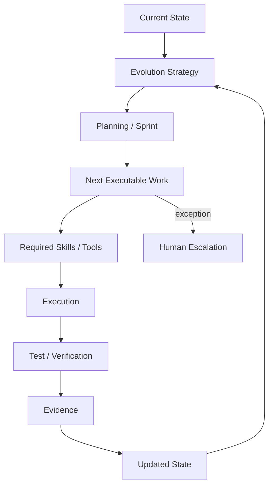

# 39 — Alignment Before Oleada 3

## Control

- **snapshot_base:** `HK-2026-09-02.1`
- **delta_id:** `HK-DELTA-ALIGN-O3-01`
- **status:** `DRAFT`
- **devin_status:** `PREPARED_NOT_DELIVERED`
- **target_readiness:** `HAPPY_HANDOFF_READY`
- **current_readiness:** `NOT_READY`
- **source:** user directive `HAPPY — ALIGNMENT BEFORE OLEADA 3`

Este documento es un delta. No reinicia la recuperación A–F, no sustituye el dossier de 114 páginas, el Control Maestro, el Knowledge Pack, el manifiesto, el reporte de validación ni los diagramas ya revisados.

## Cambio de criterio de handoff

El handoff final no será una colección de documentos para lectura pasiva. Será un repositorio operativo que permita a una sesión nueva de Devin:

1. reconstruir el propósito y los límites del producto sin redescubrimiento;
2. diferenciar decisión, diseño, implementación reportada, implementación observada y verificación;
3. localizar Specs, relaciones, contratos, criterios de aceptación y evidencia;
4. determinar el siguiente trabajo ejecutable a partir de dependencias, estado y estrategia de evolución;
5. seleccionar Skills y Tools autorizadas;
6. ejecutar, probar, producir evidencia y actualizar el estado;
7. escalar solamente excepciones reales.

El estado `HAPPY_HANDOFF_READY` sólo puede alcanzarse cuando el repositorio tenga entradas operativas coherentes, no cuando exista únicamente documentación extensa.

## Modelo de operación objetivo

## Taxonomía obligatoria

| Entidad | Definición operativa | No confundir con |
|---|---|---|
| `CAPABILITY` | Resultado institucional reutilizable que el sistema puede ofrecer | componente físico o agente |
| `COMPONENT` | Unidad de software con responsabilidades, interfaces y deployment definidos | capability |
| `AGENT` | Rol de razonamiento/ejecución con contrato, permisos y escalamiento | modelo LLM, Skill o Tool |
| `SKILL` | Procedimiento versionado que guía al agente para una clase de trabajo | Tool o servicio |
| `TOOL` | Operación invocable con input/output, policy class y efecto explícitos | Skill |
| `SERVICE` | Componente ejecutable que expone capacidades mediante ports/interfaces | agente |
| `WORKFLOW` | Secuencia gobernada de estados, actividades y decisiones | Sprint |
| `SPRINT` | Contenedor/capacidad de planificación y gestión de trabajo con objetivo, alcance, Work Items, dependencias y cierre | Spring, Spring Boot o agente |
| `WORK_ITEM` | Unidad ejecutable y trazable de trabajo dentro o fuera de un Sprint | prompt o conversación |
| `SPEC` | Contrato estable y versionado de comportamiento o estructura | implementación |
| `DECISION` | Elección explícita con autoridad y vigencia | propuesta |
| `ADR` | Registro formal de una decisión arquitectónica significativa | idea o tecnología observada |
| `EVENT` | Hecho inmutable, correlacionable e idempotente | comando |
| `DATA_MODEL` | Estructura semántica y reglas de datos | store específico |
| `RISK` | Incertidumbre con impacto, owner y tratamiento | finding sin evaluación |
| `CONTROL` | Medida preventiva, detectiva o correctiva trazable a riesgo/requisito | recomendación genérica |
| `REFERENCE` | Fuente externa/interna versionada que informa una decisión | estándar corporativo aprobado |

### Sprint

`Sprint` queda incorporado como entidad y capacidad de Planning/Work Management. No es un agente. Devin puede planear y ejecutar Work Items; Architecture AI preserva objetivo, alcance, dependencias, restricciones, estado, criterios de entrada/salida y evidencia. Esto no crea un motor de orquestación propio que replique a Devin.

La especificación relacionada será `AAI-SPEC-0037 — Planning, Sprint & Work Item Management`, inicialmente `DISCOVERED`. Su formalización completa se difiere hasta recuperar el modelo histórico discutido y reconciliarlo con `AAI-SPEC-0009`, `0015`, `0018` y `0029`.

### Blueprint

`Blueprint` se registra como `PROPOSAL`, no como decisión previa. Puede convertirse en una proyección de evolución con estado actual, objetivo, etapas, dependencias y criterios de convergencia. No gobierna implementación ni reabre decisiones congeladas mientras no sea aprobado.

## Autonomía gobernada de Devin

Devin puede continuar sin solicitar una nueva decisión cuando:

- el Work Item está seleccionado por reglas conocidas;
- todas sus dependencias obligatorias están satisfechas;
- existe una Spec suficientemente madura;
- el estado actual y el baseline aplicable son legibles;
- las Skills/Tools requeridas están disponibles y autorizadas;
- los criterios de entrada, salida y validación son explícitos;
- no se modifica una decisión congelada ni se acepta riesgo material;
- la ejecución puede producir evidencia reproducible.

Debe escalar con código explícito cuando encuentre:

- `HUMAN_DECISION_REQUIRED`;
- `ARCHITECTURE_CONFLICT`;
- `SECURITY_POLICY_CONFLICT`;
- `MISSING_EXTERNAL_ACCESS`;
- `UNRESOLVED_REQUIREMENT`;
- `STALE_OR_UNKNOWN_BASELINE`;
- `UNAUTHORIZED_TOOL_OR_SIDE_EFFECT`;
- `INSUFFICIENT_EVIDENCE_FOR_CANONICAL_CHANGE`.

No debe preguntar de nuevo qué stack, decisión, componente, flujo, alternativa o siguiente paso usar cuando ya esté documentado con autoridad y vigencia suficientes.

## Autoevolución gobernada

La autoevolución es un workflow de propuesta y verificación:

`OBSERVATION → GAP/OPPORTUNITY → IMPACT_ANALYSIS → PROPOSED_EVOLUTION → SPEC/SKILL/COMPONENT/PLAN_CHANGE → VERIFICATION → NEW_CANONICAL_VERSION`

Reglas:

- no cambia arquitectura arbitrariamente;
- no reabre decisiones humanas congeladas por conveniencia;
- toda propuesta declara impacto, riesgos, evidencia, reversibilidad y autoridad requerida;
- Skills, Tools y componentes pueden evolucionar por uso real y resultados;
- Git conserva la versión canónica aprobada;
- las proyecciones se actualizan después del cambio canónico;
- la falta de verificación impide elevar una propuesta a estado vigente.

## Conflictos con el snapshot previo

| Tema | Estado anterior | Alineación actual | Tratamiento |
|---|---|---|---|
| Prompt siguiente | El snapshot conservaba borradores etiquetados 02/03 y una futura referencia 04 | Sólo los runs Devin 00 y 01 están confirmados; la siguiente secuencia efectiva es `PROMPT_SEQUENCE_UNRESOLVED` | preservar IDs históricos, retirar inferencia de orden de envío |
| Sprint | No estaba definido en el catálogo recuperado | entidad/capacidad explícita, distinta de Spring Boot | añadir término y `AAI-SPEC-0037` como `DISCOVERED` |
| Planning | Prompt 00 excluye un implementation-planning engine propio | Sprint gobierna Work Items; Devin realiza planificación/ejecución | registrar como aclaración de alcance, no reemplazo de Devin |
| Blueprint | No estaba aprobado | `PROPOSAL` opcional de modelado de evolución | no elevar a decisión |
| Graph ADR | Se proponía producir ADR-0004 en Oleada 3 | evidencia actual insuficiente para ADR definitivo | recuperar alternativas, código, cambios y gates antes del ADR |
| Handoff | Context pack documental | bootstrap operativo con assets, Skills, estado, roadmap, gates y reglas de autonomía | ampliar sin duplicar documentos existentes |

## Resultado de alineación

- recuperación A–F: `PRESERVED / NOT_RESTARTED`;
- artefactos validados: `PRESERVED`;
- estado global: `DRAFT / PREPARED_NOT_DELIVERED`;
- handoff readiness: `NOT_READY`;
- Oleada 3 segura: formalización lógica y vendor-neutral de `AAI-SPEC-0004..0008`;
- Oleada 3 diferida: Graph ADR definitivo, catálogo real MCP/Skills, repo mapping, ejecución Java 21/tests y numeración del siguiente prompt Devin.

## Reconciliación Seed V1 — Oleada 3C

La alineación se extiende sin sustituirla: el handoff se modela como `Seed + Architectural DNA + Initial Knowledge Model + Target Capability Map + Evolution Rules + Operating Model + Expansion Contract` (`AAI-DEC-0020`). Su propósito es preservar known intent y permitir expansión post-handoff, no completar todas las ramas dentro de Work.

El operating model post-cutover deja de usar prompts/Waves como orquestador (`AAI-DEC-0021`). El staging personal declarado por el usuario es transporte temporal y no implementation repository (`AAI-DEC-0022`). Readiness queda sujeto a G1..G11 con evidencia; unknowns explícitos de G12 son admisibles (`AAI-DEC-0023`).

Estado posterior a 3C: `DRAFT / PREPARED_NOT_DELIVERED`, `HAPPY_HANDOFF_READY = FALSE`.
