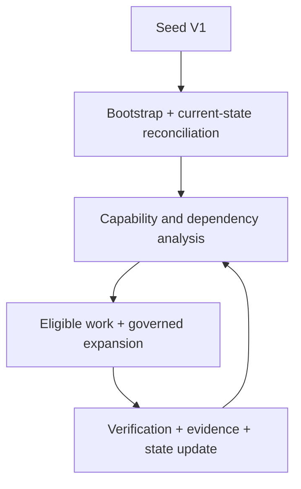

# 55 — Seed V1 Model & Architectural DNA

## Control

| Campo | Valor |
|---|---|
| `artifact_id` | `HAPPY-KNOW-55` |
| `model_id` | `ARCHITECTURE_AI_SEED_V1` |
| `version` | `0.1.0-draft` |
| `status` | `DRAFT` |
| `delivery_status` | `PREPARED_NOT_DELIVERED` |
| `implementation_status` | `NOT_APPLICABLE` |
| `source_basis` | frozen decisions, Specs/catalog, Work alignment/3B, `P-WAVE-3C-01` |
| `HAPPY_HANDOFF_READY` | `FALSE` |

## Seed V1

`Seed V1` es el mínimo estructural suficiente para que una sesión nueva de Devin comprenda el producto, reconstruya el estado, razone sobre capabilities/dependencies, expanda ingeniería bajo gobierno y produzca evidencia/deltas sin depender del chat original.

`BOOTSTRAP ≠ FULL PLATFORM.` La Seed contiene raíces, DNA, mapa de ramas y reglas de crecimiento. Comprime conversaciones; no comprime destructivamente decisiones, contratos, criterios, evidencia ni futuro ya pensado.

## North Star

Construir Architecture AI como plataforma de inteligencia institucional de arquitectura, inicialmente local-first, que complemente a Devin con conocimiento bancario gobernado, contexto, evidencia, decisiones, Specs, relaciones, policy, trazabilidad y capacidades determinísticas; permita ejecución verificable y evolución controlada; y pueda centralizar selectivamente capacidades cuando la colaboración, escala, disponibilidad, seguridad u operación lo justifiquen.

Resultado deseado post-handoff:

`CURRENT STATE → CAPABILITY/DEPENDENCY ANALYSIS → NEXT EXECUTABLE WORK → EXPANSION → EXECUTION → VERIFICATION → EVIDENCE → UPDATED STATE → REPLANNING`.

Devin aporta razonamiento, investigación, planning, coding y ejecución agentic. Architecture AI aporta identidad durable, conocimiento institucional, autoridad, política, contexto, evidencia, estados, proyecciones, evaluación y continuidad.

## Composición mínima de Seed V1

| Elemento | Contenido | Fuente/hogar | Estado 3C |
|---|---|---|---|
| `SEED_IDENTITY` | nombre, versión, status, snapshot, hashes, cutover state | manifest/readiness | `DRAFT` |
| `NORTH_STAR` | producto, problema, target operating outcome | este documento + Master Context | `COVERED_DRAFT` |
| `ARCHITECTURAL_DNA` | invariantes canónicos/derivados/propuestos | este documento + decision baseline | `COVERED_DRAFT` |
| `INITIAL_KNOWLEDGE_MODEL` | layers, vectors, relations y evolution rule | documento 56 | `DERIVED_MODEL_DRAFT` |
| `TARGET_CAPABILITY_MAP` | current/target/maturity/dependencies/evolution | documentos 54/56 | `PARTIAL_HIGH` |
| `CAPABILITY_DEPENDENCY_GRAPH` | habilitadores y critical paths | documento 57 | `DRAFT`; repo/runtime edges blocked |
| `OPERATING_MODEL` | Work Model V1, future model, expansion, loops/harness | documento 58 + 0009/0010 | `DRAFT` |
| `CURRENT_STATE` | design vs reported implementation vs verification | docs 26/27/28 | `REPORTED_PARTIAL`; source-gated |
| `DECISIONS_AND_CONSTRAINTS` | frozen/current/proposal/rejected/conflicted | decision baseline + gaps | `PARTIAL_HIGH` |
| `SPECS_AND_RELATIONS` | catalog, formal specs, mappings and gaps | docs 22/23/24/53 | `PARTIAL_HIGH` |
| `EVOLUTION_RULES` | evidence/version/migration/approval/cutover | docs 41/58/59/60 | `DRAFT` |
| `RESEARCH_OBLIGATIONS` | question, source, criteria, enabled decision | doc 62 + SER register | `DRAFT` |
| `BOOTSTRAP_ASSETS` | AGENTS, BOOTSTRAP, CONTEXT, REPOSITORY MAP | `bootstrap/` + doc 40 | `SKELETON_DRAFT` |
| `QUALITY_GATES` | G1..G12 and acceptance scenario | doc 61 | `NOT_PASSED` |

## Architectural DNA register

### Canonical invariants

Estas reglas se derivan directamente de decisiones congeladas o reglas explícitas de fidelidad ya vigentes. Cambiarlas requiere una decisión/ADR gobernado; una sesión o resultado agentic no puede reabrirlas silenciosamente.

| DNA ID | Invariante | Base | Implicación de expansión |
|---|---|---|---|
| `DNA-CAN-001` | Local-first before centralization | FD-002 / AAI-DEC-0002 | OpenShift y servicios compartidos requieren triggers/evidence; no son prerrequisito V1 |
| `DNA-CAN-002` | Devin ≠ Architecture AI | FD-001 / AAI-DEC-0001 | no reconstruir runtime general de agentes; Devin razona/ejecuta, Architecture AI gobierna/contextualiza |
| `DNA-CAN-003` | Git es autoridad canónica para conocimiento aprobado | FD-003 / AAI-DEC-0003 | graph/index/cache/views son derivados salvo decisión explícita |
| `DNA-CAN-004` | Contexto complejo se resuelve por `taskId` + Work Package | FD-004 / AAI-DEC-0004 | no usar conexión, prompt o sesión como identidad durable |
| `DNA-CAN-005` | Ingesta/inferencia no equivalen a promoción | FD-005 / AAI-DEC-0009 | evidence, reconciliation y authority preceden canonical state |
| `DNA-CAN-006` | Deterministic Before Agentic / Least Agency | FD-006 | deterministic cuando reglas bastan; agentic cuando se necesita razonamiento; humano cuando existe authority o juicio irreducible; toda migración requiere evidencia |
| `DNA-CAN-007` | Core actual requiere Java 21 + Spring Boot | FD-007 | baseline actual, no constraint eterno; evolución LTS gobernada |
| `DNA-CAN-008` | Desktop es thin client | FD-008 | no colocar verdad, policy o lógica de dominio en la UI |
| `DNA-CAN-009` | Estado de diseño, implementación, prueba y verificación nunca se eleva sin evidencia; un LLM no puede autocertificar corrección | compiler fidelity rule + `P-SEED-ACCEPT-01` | code ≠ verified; test written ≠ passed; documentation ≠ working system; una afirmación técnicamente verificable requiere evidencia determinística antes de promoción |
| `DNA-CAN-010` | No silent reconciliation/drift/reopening | compiler + 0004/0007/0014 | toda contradicción, supersession o drift produce registro y receipt |
| `DNA-CAN-011` | Autonomía es gobernada | AAI-DEC-0015 + 0006/0009/0010 | sólo avanzar bajo scope, authority, capabilities, evidence y gates |
| `DNA-CAN-012` | Evolución es basada en evidence, versionada y verificable | AAI-DEC-0019 | ninguna autoevolución modifica estado canónico por observación directa |
| `DNA-CAN-013` | Waves son mecanismo interno; handoff es una Seed consolidada | AAI-DEC-0012 | no operar post-cutover por “siguiente wave/prompt” |
| `DNA-CAN-014` | Sprint es Planning/Work Management, no Spring Boot ni Agent | AAI-DEC-0014 | 0037 no autoriza motor agentic custom ni cambia lifecycle 0009 |
| `DNA-CAN-015` | Seguridad, auditabilidad y provenance son transversales | security/governance corpus | toda expansión evalúa controles, evidencia, ownership y trazabilidad |
| `DNA-CAN-016` | No sensitive data in public bootstrap staging | `P-WAVE-3C-01` execution boundary | excluir secrets, credentials, tokens, PAN y payloads restringidos |
| `DNA-CAN-017` | Visibility, discovery and platform knowledge do not transfer ownership or authority | P-WAVE-3E-01 + FD-001/005/006 + ownership/authority model | Architecture AI observa/modela/federa; el dominio y la autoridad institucional conservan decisión y operación |
| `DNA-CAN-018` | Capability, visibility, access, authority, readiness and adoption are distinct states | P-SEED-ACCEPT-01-RESUME-01 + authority/evidence model | un recurso reachable o con credenciales no autoriza su uso; implemented no equivale a user-ready ni adoptable; toda mutación respeta environment, delivery path y authority |

### Derived invariants

Son conclusiones coherentes con varias decisiones/Specs, pero requieren validación humana antes de considerarse política arquitectónica congelada.

| DNA ID | Invariante derivado | Evidence basis | Estado |
|---|---|---|---|
| `DNA-DER-001` | Work outlives session | 0004/0005/0009 + bootstrap objective | `DERIVED_INVARIANT` codificado en 0009 v0.2 |
| `DNA-DER-002` | Session state is not institutional memory | Git authority + Work Package/provenance | `DERIVED_INVARIANT` |
| `DNA-DER-003` | Agent instance is ephemeral; work responsibility persists | agent contract + delegation/state receipts | `DERIVED_INVARIANT` |
| `DNA-DER-004` | One authoritative home per governed information type | Git canonical + projection recovery | `DERIVED_INVARIANT` |
| `DNA-DER-005` | Author/version once; render/publish many | docs-as-code/projection model | `DERIVED_INVARIANT` |
| `DNA-DER-006` | Human interaction is exception path after recoverable knowledge/research is exhausted | autonomy + question/escalation models | `DERIVED_INVARIANT`; operational proof absent |
| `DNA-DER-007` | Every AI use case requires a non-AI baseline | Least Agency + evaluation requirements | `DERIVED_INVARIANT`; AI registry proposed |
| `DNA-DER-008` | Architecture consistency must be proven continuously | projection/readiness/tests/drift model | `DERIVED_INVARIANT`; checks incomplete |
| `DNA-DER-009` | Repository boundaries follow governance/product boundaries, not module boundaries | modular monolith + knowledge continuity | `DERIVED_INVARIANT`; repo source absent |
| `DNA-DER-010` | Multi-cluster is not evidence of high availability | reliability semantics | `DERIVED_INVARIANT`; requires SLO/topology validation |
| `DNA-DER-011` | Non-intrusive introspection precedes agreed integration or automation | capability discovery + policy/evidence gates | `DERIVED_INVARIANT`; runtime proof/source access absent |
| `DNA-DER-012` | Central and domain knowledge learn bidirectionally through governed reconciliation | 0004/0007 + model evolution + local variants | `DERIVED_INVARIANT`; no direct observation→canonical path |
| `DNA-DER-013` | Domain UX is a permission-aware projection of the common governed model, not a new silo | thin client + projection/documentation model | `DERIVED_INVARIANT`; product evidence pending |
| `DNA-DER-014` | Tree decomposes, Graph relates, Assurance supports claims and Loops advance state | capability/dependency/trace/evidence/loop models | `DERIVED_SYNTHESIS`; not a new proprietary framework |
| `DNA-DER-015` | Agent is not the capability; Agent/Skill/Tool/service/workflow/human are possible realizations selected by need, evidence and authority | Least Agency + capability/agent/tool models | `DERIVED_INVARIANT`; exact runtime/catalog remains source-gated |
| `DNA-DER-016` | Readiness is profile-specific and evidence-backed | deterministic assurance + federated/domain authority + acceptance direction | `DERIVED_INVARIANT`; builder, controlled pilot, architect, chief/domain and federation readiness cannot be inferred from one shared percentage |

### Proposed invariants

| DNA ID | Candidato | Justificación | Gate |
|---|---|---|---|
| `DNA-PRO-001` | Standard before custom | reduce custom semantics/maintenance | 3D standards substitution and gaps |
| `DNA-PRO-002` | Reuse before reimplementation / no reinventar la rueda | exploit corporate/framework capabilities | corporate capability/source validation |
| `DNA-PRO-003` | Corporate Capability First | avoid assuming unavailable products | official capability catalog/owner |
| `DNA-PRO-004` | Loop owns continuity; agent participates in an iteration | prevent session/agent-owned control loops | BPMN/CMMN/DMN fit and operating validation |
| `DNA-PRO-005` | Chat explains/orients; specialized experiences handle specialized work | improve product experience and control | UX/persona research |
| `DNA-PRO-006` | One canonical meaning; multiple localized presentations | semantic stability across locales | terminology/i18n standards and governance |
| `DNA-PRO-007` | ML detects; policy decides | preserve institutional authority | AI governance/evaluation gate |
| `DNA-PRO-008` | Optimize at system boundary, not only component boundary | prevent local convenience from harming total system | performance/capacity evidence profile |
| `DNA-PRO-009` | Automation should shift human effort toward higher-authority value, not assume organizational elimination | preserve people, authority and knowledge production during maturity changes | institutional governance/owner evidence and transition validation |

## North Star and target coverage

| Target | Visibility in Seed | Depth | Blocker |
|---|---|---|---|
| local operable platform | `VISIBLE` | architecture/design high; runtime low | SER-002/003/006/009 |
| autonomous continuation | `VISIBLE` | lifecycle/bootstrap design medium-high | restart/receipt test not executed |
| governed Spec expansion | `VISIBLE` | contract/rules high | baseline/repo mapping absent |
| evidence-based state updates | `VISIBLE` | schema/design high | runtime/test absent |
| institutional context/banking reasoning | `VISIBLE` | contextual medium | SER-001/007 |
| eventual centralization | `VISIBLE` | direction only | volumetry/SLO/security/ownership; 0031 deferred |
| continuous governed evolution | `VISIBLE` | model draft | Loop/Harness/research standards and evidence |
| user not reconstructing old knowledge | `VISIBLE` | goal explicit | No-Loss final proof needs SER-001/012 |
| federated organizational evolution | `VISIBLE` | target model and authority boundary explicit | SER-014; domain evidence and agreed integration |
| deterministic maturity | `VISIBLE` | routing/migration contract high; evidence absent | Harness history, owner and shadow validation |
| Tree/Graph/Assurance/Loop knowledge geometry | `VISIBLE` | derived synthesis; standards unselected | RO-3E-001..003; Graph ADR remains deferred |

## Seed exclusions

Seed V1 no pretende incluir implementación exhaustiva de Graph, ML, Harness, OpenShift, Agents, Skills, Tools, UX/UI, installer, Planning/Sprint, technology evolution ni todas las Specs candidatas. Debe hacer esas ramas visibles, conectadas, gobernadas y expandibles.

No contiene secretos, credenciales, access tokens, passwords, PAN, raw sensitive banking data ni payloads restringidos. El staging público no modifica estas reglas.

## Expansion invariant

Antes de crear una Spec o implementar una capability:

1. buscar capability, Spec, decision, invariant y rejected alternative existentes;
2. comprobar estándares/frameworks/libraries/capabilities corporativas;
3. identificar current/target state, dependencies, cross-cutting concerns y evidence;
4. crear o enriquecer la capa mínima necesaria;
5. verificar y registrar receipt/delta;
6. promover sólo mediante autoridad explícita.

## Estado

`SEED_V1_MODEL_ESTABLISHED = TRUE_DRAFT`

`SEED_V1_QUALITY_GATES_PASSED = FALSE`

`HAPPY_HANDOFF_READY = FALSE`

## rc2 authority note

The North Star and DNA identities remain unchanged. [Document 90](90_POST_RC1_RECONCILIATION.md) clarifies governance/control/diagnostic value, projection consistency and latest-JDK-source reconciliation without treating a reported configuration as permission or verification. Historical Seed-status fields above are superseded for delivery scope by the root manifest/readiness, not rewritten retroactively.
