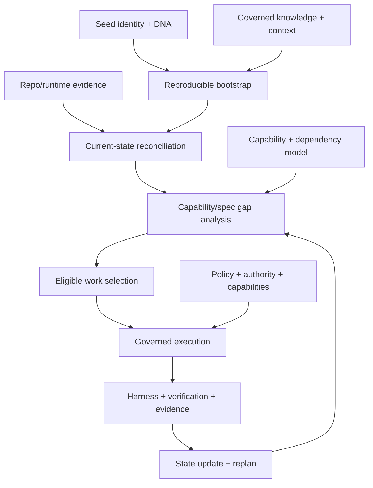
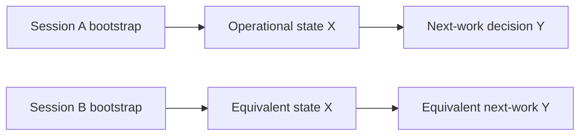

# 57 — Capability Dependency Graph & Autonomy Critical Path

## Control

| Campo | Valor |
|---|---|
| `artifact_id` | `HAPPY-KNOW-57` |
| `status` | `DRAFT` |
| `delivery_status` | `PREPARED_NOT_DELIVERED` |
| `graph_scope` | capability-level evidence-backed dependencies; not implementation topology |
| `prioritization_status` | `PRIORITIZATION_MODEL_INCOMPLETE` |

## Dependency graph



La ruta contiene dos tipos de prerequisito: conocimiento/contrato y evidencia de implementación. La Seed puede modelar la primera; no puede sustituir la segunda sin repo/runtime.

## Edges registrados

| Edge ID | Capability source | Relación | Target | Evidencia | Confidence / límite |
|---|---|---|---|---|---|
| `CDEP-001` | Seed identity + DNA | `ENABLES` | Reproducible Bootstrap | P-WAVE-3C-01, bootstrap skeletons | high design; execution absent |
| `CDEP-002` | Governed Knowledge + Context | `ENABLES` | Reproducible Bootstrap | 0001/0005/0024 | high design |
| `CDEP-003` | Work/Session Continuity | `ENABLES` | Restart/Resume | 0009 v0.2 + bootstrap target | high design; runtime absent |
| `CDEP-004` | Repo/Runtime Evidence | `REQUIRED_BY` | Current-State Reconciliation | baseline/gap matrix | blocked by SER-002/003/006 |
| `CDEP-005` | Reproducible Bootstrap | `ENABLES` | Current-State Reconciliation | BOOTSTRAP receipt model | execution not proven |
| `CDEP-006` | Current-State Reconciliation | `ENABLES` | Implementation Gap Analysis | docs 26/27 + Skill candidate | high concept |
| `CDEP-007` | Target Capability Map | `ENABLES` | Capability Gap Analysis | docs 54/56 | draft map |
| `CDEP-008` | Spec/Relationship Model | `ENABLES` | Dependency Impact Analysis | docs 22/23/53 + SKILL-CAND-007 | runtime graph optional |
| `CDEP-009` | Gap + Dependency Analysis | `ENABLES` | Eligible Work Selection | 0009/0037/bootstrap | Sprint depth source-gated |
| `CDEP-010` | Policy + Authority | `GOVERNS` | Governed Execution | 0006/0015/0028 | tool/identity evidence absent |
| `CDEP-011` | Exact Skills/Tools/Capabilities | `REQUIRED_BY` | Governed Execution | 0017/0035 | blocked by SER-004/005 |
| `CDEP-012` | Architecture Work Package | `REQUIRED_BY` | Contextual Execution | 0005/0009 | implementation partial reported |
| `CDEP-013` | Verification/Harness | `VALIDATES` | Execution Result | 0020–0023/0029 | design; test runs absent |
| `CDEP-014` | Evidence/Receipts | `REQUIRED_BY` | State Update | 0004/0008/0009/0010 | schemas draft; runtime absent |
| `CDEP-015` | State Update | `ENABLES` | Replanning/Next Work | 0009 + bootstrap | design only |
| `CDEP-016` | Research Engineering | `ENABLES` | Standards/Technology/Capability Decisions | 0010/0018/0032/0033 | research protocol draft needed |
| `CDEP-017` | Corporate Capability Discovery | `PRECEDES` | New Technology Proposal | Native First + P-WAVE-3C-01 | corporate catalog source-gated |
| `CDEP-018` | Consistency/Conformance | `VALIDATES` | Bootstrap, Specs, Implementation and Projections | 0008/0014/0021/0022 | checks incomplete |
| `CDEP-019` | Loop Engineering | `USES` | Harness, Evidence and State Update | 0018/0019/0029 + 3C | standard fit pending |
| `CDEP-020` | Model Evolution | `USES` | Evidence + Impact + Migration + Verification | P-WAVE-3C-01 | governance model draft |
| `CDEP-021` | Threat Model Projection | `DEPENDS_ON` | Canonical Architecture Model | security/threat docs | standards projection pending |
| `CDEP-022` | AI Use Case Governance | `DEPENDS_ON` | Non-AI Baseline + Evaluation + Policy | Least Agency/0019/0029 | datasets/gates absent |
| `CDEP-023` | Documentation Projection | `DEPENDS_ON` | Canonical Source + Conflict Model | Git decision/0034 | Confluence capability source-gated |
| `CDEP-024` | Selective Centralization | `DEPENDS_ON` | Workload + SLO + Security + Cost + Operations | FD-002/0031 | future evidence absent |

## Critical paths toward self-sufficiency

### CP-1 — Bootstrap and current state

`Seed integrity → bootstrap receipt → repo/runtime observation → current-state reconciliation → implementation gaps`.

Blockers: `SER-002`, `SER-003`, `SER-006`, `SER-009`, staging access blocker.

### CP-2 — Safe next work

`Capability map → dependency graph → eligibility gates → Work Item → Work Package → Skill/Tool availability → policy/authority`.

Blockers: `SER-004`, `SER-005`, `SER-010`; exact ordering remains incomplete.

### CP-3 — Closed evidence loop

`Execution → harness/checks/tests → evidence → StateUpdateDelta → consistency/reconciliation → next work`.

Blockers: implementation/repo mapping and Java/test receipts. Event transport is not required for the documentary Seed, but is required for a full runtime.

### CP-4 — Safe expansion

`Known capability/intent → existing Spec/decision/standard search → thin extension/new Spec only if needed → implementation/test/evidence`.

Blockers: standards dedup/substitution 3D, raw chats/standards corpus `SER-001/011`.

## Eligibility before priority

Un Work Item no participa en priorización si:

1. dependency o entry criterion no está satisfecho;
2. falta una decisión/authority obligatoria;
3. requiere una Skill/Tool/capability no observada;
4. su verification/evidence no puede ejecutarse;
5. viola una decisión congelada o seguridad;
6. depende de una fuente no disponible y no existe trabajo alternativo independiente.

## Self-sufficiency prioritization model

No existe evidencia suficiente para congelar pesos, algoritmo o backlog. Se registra `PRIORITIZATION_MODEL_INCOMPLETE`. La evaluación candidata, después de eligibility, debe considerar:

| Dimension | Pregunta | Evidence requerida |
|---|---|---|
| blocker release | ¿cuántos Work Items/capabilities desbloquea? | dependency edges and blocked work |
| critical-path impact | ¿reduce la distancia a bootstrap/reconcile/execute/verify/replan? | CP-1..CP-4 |
| security/governance | ¿reduce riesgo o habilita acción gobernada? | risk/control/authority mapping |
| context/evidence readiness | ¿mejora calidad/frescura/reproducibilidad de contexto? | retrieval/evidence metrics |
| verification leverage | ¿convierte claims reportados en evidence reusable? | test/harness receipts |
| operational readiness | ¿reduce fragilidad/restart/manual intervention? | runtime/operations evidence |
| usability | ¿permite al usuario comprender/controlar/reanudar? | UX/accessibility evidence |
| learning/evaluation | ¿genera datos para decisiones y migración determinística? | evaluation plan/dataset |
| cost/resource impact | ¿reduce costo total o evita capacidad innecesaria? | workload/cost model |
| reversibility | ¿es seguro, incremental y reversible? | rollback/migration plan |

No se suman números ni se asignan thresholds en 3C. Conflictos de prioridad materiales se escalan mediante Decision Package.

## Candidate autonomy-enabling order

Esto no es Sprint ni roadmap aprobado. Es una precedencia respaldada por gates:

1. package/manifest integrity and bootstrap-readable navigation;
2. repository/runtime/current baseline observation;
3. exact Skills/Tools/capability/permission discovery;
4. reproducible build/test/evidence;
5. dependency-aware eligible-work selection;
6. verified state update/restart equivalence;
7. standards substitution and capability expansion.

Las fuentes que lleguen pueden permitir trabajo paralelo o cambiar el orden sin alterar las dependencias.

## Active frontier and multi-architect allocation

`KNOWN_INTENT / KNOWN_FUTURE → CURRENT_MATURITY_TARGET → RELEVANT_SUBTREE → EXECUTABLE_FRONTIER → AVAILABLE_PARALLEL_CAPACITY → ACTIVE_WORK`.

This selection prevents a known future branch from becoming active merely because it exists. Independent eligible nodes are parallel candidates, but assignment starts from the Work Graph and considers dependencies, required capability/context, ownership, authority and available human/machine/agent/tool/service resources. It never starts from `N architects = N agents`.

Environment or delivery work is eligible only after the applicable environment identity, institutional delivery path, allowed operations and authority are observed. Reachability or credentials never satisfy the authority prerequisite. Same-fixture cross-environment comparison additionally requires explicit authorization for every target and a declared expected-variance model.

## Restart equivalence target



La equivalencia es operacional, no textual. Debe usar las mismas versiones canónicas, dependencias, capabilities, permissions, blockers y evidence; divergencia produce consistency finding.

## Estado

`CAPABILITY_DEPENDENCY_GRAPH = DRAFT_WITH_EVIDENCE_GAPS`

`AUTONOMY_CRITICAL_PATH = IDENTIFIED_AT_CAPABILITY_LEVEL`

`PRIORITIZATION_MODEL_INCOMPLETE = TRUE`

## Acceptance extension — Objective Tree, dependency graph and executable frontier

`Execution Frontier` is retained as a descriptive acceptance term, not a frozen platform type. It is derived from the existing Objective/Capability Tree, dependency graph and Work eligibility rules.

A node is executable only when all applicable conditions hold:

```text
dependencies satisfied
AND entry criteria satisfied
AND required context available and fresh
AND required capability/Skill/Tool observed
AND required authority available
AND verification/evidence strategy executable
AND no blocking architecture/security conflict
AND no unresolved mandatory human decision
```

Independent executable nodes form a parallel candidate set. Parallelism is allowed only when isolation, shared-resource constraints, merge/conflict behavior, budgets and evidence correlation are explicit. The Seed does not impose a serial queue or invented ranking.

After any execution: `WORK → VERIFICATION → EVIDENCE → STATE_UPDATE → DEPENDENCY_RECALCULATION → NEXT_EXECUTABLE_FRONTIER`.

### First frontier from the current documentary state

| Candidate | Current eligibility | Blocker / condition | Evidence needed |
|---|---|---|---|
| verify Seed integrity from a clean unpack | `ELIGIBLE_FOR_CLEAN_CONSUMER` | independent consumer/session not yet run | integrity log + BootstrapReceipt |
| reconcile implementation repository | `BLOCKED_BY_SOURCE` | `SER-002`, then `SER-003/006` | repo/branch/commit + raw baseline + build/test receipts |
| derive actual code/capability frontier | `BLOCKED_BY_SOURCE` | current implementation state unavailable | ReconciliationReceipt + dependency state |
| execute Self-Knowledge/Documentation milestone | `POST_RECONCILIATION_CANDIDATE` | implementation/retrieval/projection capability unobserved | fixture result + deterministic output validation |
| execute Knowledge Ingestion milestone | `POST_DOCUMENTATION_CANDIDATE` | ingestion runtime and governed source absent | ingestion/promotion/projection/restart evidence |
| bounded standards research | `CONDITIONALLY_PARALLEL` | each RO trigger, source access and policy | preregistered criteria + research receipt; no automatic adoption |

This table prepares G5; it does not pass G5 and does not authorize Work to implement.

## rc2 dependency refinement

Physical Graph design requires RO-RC2-001 and SER-008 reconciliation. Current-purpose multi-projection context requires verified compatible projection sets (0005→0008). Diagnostic ML promotion requires governed data, baseline, preregistered comparison criteria, Harness evidence and authority. These are supported target conditions, not observed runtime edges or invented rankings. See [document 90](90_POST_RC1_RECONCILIATION.md).
