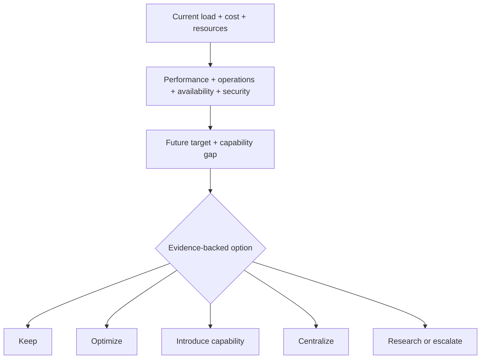

# 59 — Technology, Infrastructure, Cost & Evolution Model

## Control

| Campo | Valor |
|---|---|
| `artifact_id` | `HAPPY-KNOW-59` |
| `status` | `DRAFT` |
| `delivery_status` | `PREPARED_NOT_DELIVERED` |
| `decision_scope` | criteria and intent visibility; no new technology selection |
| `graph_adr` | `DEFERRED_PENDING_EVIDENCE` |
| `openshift_architecture` | `NOT_FROZEN` |

## State taxonomy

- `CURRENT_BASELINE`: target or implementation state currently established by decision/evidence.
- `REPORTED_BASELINE`: state reported by Devin, not directly observed.
- `TARGET_POLICY`: desired rule pending authority/standards/corporate validation where indicated.
- `EVOLUTION_RULE`: evidence-based trigger/gate; not automatic upgrade.

## Technology evolution register

| Area | Current / reported baseline | Target intent | Evolution rule / gate | Classification |
|---|---|---|---|---|
| Java | Java 21 is frozen current requirement; Java 8 was reported effective runtime blocker | remain on corporately approved, supported Java LTS over time | NEW_LTS/EOL/CVE/license/corporate-baseline trigger → impact/build/test/migration/approval | current decision + target-policy candidate |
| Spring Boot | 3.2.1 reported in baseline; code/repo not observed | supported Spring Boot compatible with chosen Java LTS and module boundaries | dependency/support/security/compatibility evidence; no “latest” by preference | reported + evolution direction |
| Spring module model | modular monolith proposed; Spring Modulith candidate | capability-oriented modules and executable dependency rules | 3D CALM/Modulith/ArchUnit fit + repo spike; toolkit optional | proposal/research |
| MCP | custom/WebSocket implementation reported; exact official conformance unverified | versioned official-compatible agent interaction for tools/resources/context | inspect repo + official MCP contract/conformance; distinguish transport/system API | blocked/research |
| REST/API | connectors/admin/system integration partial | deterministic integration where bulk/delta/pagination/versioning benefit | capability benchmark by use case; OpenAPI/toolchain compatibility | direction/research |
| SQLite | current local metadata/store direction; implementation reported | retain behind ports while adequate | workload, concurrency, durability, migration and recovery evidence | current direction |
| Relational future | Postgres/Oracle possibilities discussed; not required V1 | central relational capability only if collaboration/scale/governance needs it | quantified trigger + corporate availability + migration/rollback | conditional |
| Infinispan | Embedded 14.0.21.Final reported; local projection/operational direction | recoverable cache/read-model/operational state behind contracts | persistence/restart/memory/concurrency/rebuild tests | current direction, not verified |
| Graph | JanusGraph/Berkeley DB JE reported; Neo4j Community direction conditioned | engine selected only by ADR after corpus/license/deployment/migration benchmark | `SER-008`; no code-found technology becomes final decision | deferred ADR |
| Retrieval/vector | lexical/catalog/graph baseline; vector optional | vector capability only if golden queries prove value | benchmark quality/cost/latency/security/operations; port-based | conditional |
| Redis | installed/relevant in banking and future central event/state options; not required local V1 | introduce only for specific state/stream/coordination capability | capability gap, load, operations, corporate availability and migration evidence | conditional |
| Kafka | banking integration capability; not default local event bus | use for enterprise integration/throughput justified | avoid eventing collage; contract/ownership/volume evidence | conditional/domain-specific |
| Desktop | static POC reported; thin-client decision | task/state/attention/context surface connected to backend | Devin Desktop capability/API/security spike `SER-009` | decision + blocked implementation |
| Packaging/executable | installer/update intent recovered; implementation not observed | clone/ZIP Seed bootstrap; local executable/installer for product later | OS/runtime/security/update/rollback/signing evidence | target capability |
| JFrog | candidate immutable built-artifact repository role | governed binary provenance where corporate capability exists | validate availability, coordinates, signing, retention and permissions | capability/source-gated |
| OpenShift | banking platform exists; Architecture AI local-first | selective centralization for collaboration/scale/availability/governance | volumetry/SLO/RPO/RTO/security/ownership/license/cost trigger; 0031 | later/conditional |
| Centralization | not V1 prerequisite | centralize individual capabilities, not the whole platform by default | capability-specific evidence and exit strategy | later/conditional |
| Confluence | publication/knowledge source intent; access unverified | projection/collaboration by document type | MCP-vs-API benchmark, permissions, conflict model | conditional/source-gated |

Java 21 is a current baseline, not an eternal constraint. Future LTS adoption remains governed; `latest release automatically` is rejected.

## Technology change contract candidate

1. identify technology/capability/version and current consumers;
2. capture support/EOL/CVE/license/corporate baseline evidence;
3. locate standards/framework/corporate alternatives and rejected alternatives;
4. evaluate compatibility, security, data migration, operational model, cost and rollback;
5. update decision/Spec/test/evidence plan;
6. execute only when authorized;
7. verify build/runtime/recovery and affected capabilities;
8. promote new baseline and preserve superseded state.

## Infrastructure/resource decision model

### Decision dimensions

| Dimension | Questions | Evidence before decision |
|---|---|---|
| workload | current/peak/failure load, concurrency, growth, amplification | measured baseline/scenario; no invented threshold |
| workstation resources | memory, CPU, storage, connection/process limits | target workstation profiles and runtime telemetry |
| performance | latency/throughput/backpressure/fan-out/network hops/DB pressure | system-boundary tests and bottleneck trace |
| availability/resilience | failure domains, state/compute redundancy, failover, RPO/RTO | topology, failure tests, surviving capacity |
| security/privacy/compliance | data classification, trust boundary, isolation, secrets, audit | threat/control/policy and owner evidence |
| cost | license, infrastructure, operations, model/token, support, migration | total-cost assumptions and sensitivity |
| operational complexity | install/update/backup/recovery/monitoring/on-call/support | operating model and owner readiness |
| corporate capability | available providers/patterns/entitlements/constraints | governed capability catalog |
| future evolution | local→central, multiuser, country scope, reversibility | triggers, compatibility, exit/migration plan |

### Allowed outcomes

`KEEP`, `OPTIMIZE`, `INTRODUCE_CAPABILITY`, `CENTRALIZE`, `RESEARCH_REQUIRED`, `HUMAN_DECISION_REQUIRED`.

No outcome can be selected solely because software is already installed or technically possible.

## Cost and efficiency invariants candidates

- evaluate total system efficiency, not local code convenience;
- model query/request/event amplification, remote calls, serialization, storage growth, connection usage and failure load;
- performance, cost and operational complexity are jointly evaluated;
- deterministic migration may reduce model cost only if quality/security/traceability stay acceptable;
- centralization is not inherently cheaper, safer or more available;
- two clusters do not prove resilience;
- license/entitlement constraints are architectural constraints.

## Known future directions preserved

| Direction | Visibility | Depth / blocker |
|---|---|---|
| Windows local executable/installer | `VISIBLE` | design/source incomplete; 0030 |
| automated installation/update/rollback | `VISIBLE` | implementation and signing/distribution evidence absent |
| local→central/OpenShift | `VISIBLE` | 0031 deferred; triggers/SLO/topology absent |
| shared multiuser capabilities | `VISIBLE` | conditional on collaboration/scale/governance |
| technology obsolescence watches | `VISIBLE` | research/corporate baseline needed |
| Graph engine evolution | `VISIBLE` | ADR not ready; SER-008 |
| retrieval/vector evolution | `VISIBLE` | benchmark-gated |
| agentic→Skill/Tool/service | `VISIBLE` | catalogs/evaluation source-gated |
| ML/smaller-model opportunities | `VISIBLE` | experimental; baseline/dataset/policy required |

## Explicit non-decisions

- no Graph engine selected by 3C;
- no Redis/Postgres/Kafka requirement added to local Seed;
- no OpenShift topology or migration date selected;
- no automatic Java/Spring upgrade policy approved;
- no MCP transport or Confluence mechanism frozen;
- no JFrog availability assumed;
- no infrastructure thresholds invented.

## rc2 source and research boundary

[Document 90](90_POST_RC1_RECONCILIATION.md) records user-reported Gradle/JFrog configuration, Nexus/Maven and Harbor/images without tested/authorized claims, plus a primary-source-unavailable Java25 pointer to reconcile during bootstrap. Java 21 remains the historical Seed baseline, not an eternal constraint or a reason to ignore a recovered later authorized correction. Spring Cloud Config is a configuration candidate only (RO-3C-019); Graph ADR remains open. RO-3C-012/016 extend cost/value and diagnostic ML criteria, not product adoption.
