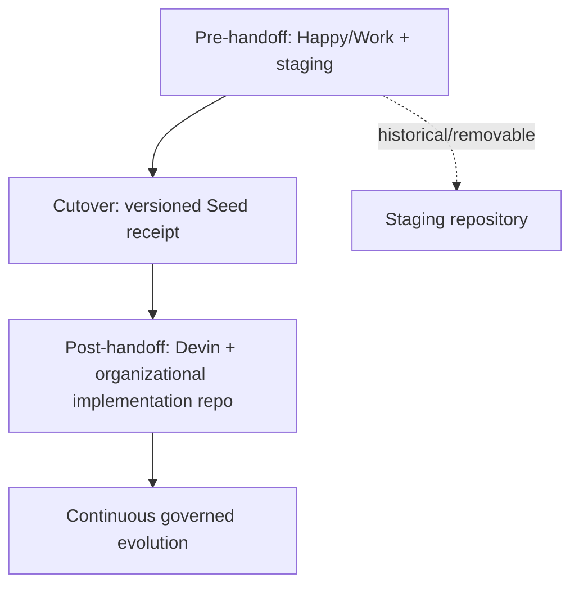

# 60 — Seed Staging, Cutover, Transport & Repository Model

## Control

| Campo | Valor |
|---|---|
| `artifact_id` | `HAPPY-KNOW-60` |
| `status` | `DRAFT` |
| `delivery_status` | `PREPARED_NOT_DELIVERED` |
| `staging_repository` | `GarciaLabastidaMiguelAngel/happy-bootstrap-staging` |
| `staging_repository_role` | `BOOTSTRAP_STAGING_REPOSITORY` |
| `staging_repository_visibility` | `PUBLIC_BY_USER_DECISION; DO_NOT_CHANGE` |
| `git_access_from_current_work` | `NOT_OBSERVED / BLOCKED` |
| `implementation_repository` | `BLOCKED_BY_SOURCE(SER-002)` |

## Repository roles

### Bootstrap staging repository — observed from user directive

`GarciaLabastidaMiguelAngel/happy-bootstrap-staging`:

- pertenece a staging personal;
- almacena/versiona la Seed preparada por Happy;
- no es el implementation repository de Architecture AI;
- no sustituye el repo organizacional de Devin ni cierra `SER-002`;
- no es autoridad operativa post-handoff;
- puede retirarse después del cutover;
- sirve como transporte mediante clone o ZIP.

La existencia/rol es `OBSERVED_USER_STATEMENT`. En el workspace actual no existe checkout `.git`, remote configurado ni conector GitHub callable; por tanto no se realizó clone, commit o push. Se registra `SER-013` para materializar acceso/snapshot cuando corresponda.

### Implementation source repository

Estado: `BLOCKED_BY_SOURCE(SER-002)`. No se infieren remote, organization, branch, commit, modules, paths, owners ni policies.

## Safe incremental Git workflow

Sólo cuando exista acceso autorizado al staging:

`WORKSPACE DELTA → VALIDATION → MANIFEST/CHECKSUM → COHERENT COMMIT → STAGING REMOTE`.

Commit units recomendadas:

- wave reconciliada;
- validated delta;
- source-reconciliation milestone;
- No-Loss milestone;
- Seed release candidate.

Cada commit debe correlacionar `wave_id`, `delta_id`, sources/evidence, manifest y validation status. No se crea un commit por archivo menor. El commit no eleva content status ni implica handoff.

## Transport-independent Seed

La misma estructura lógica debe arrancar desde repository root en dos modos:

1. `git clone <staging or authorized source>`;
2. download ZIP → verify checksum → unpack.

Ningún paso de lectura/bootstrap exige remote activo. Remote sólo aporta history/delta/fetch cuando está disponible.

### Required root contract candidate

| Root asset | Rol | Current coverage |
|---|---|---|
| `HANDOFF_MANIFEST.md` | identity, version, hashes, read order, status, provenance | partial via delta manifests; final not created |
| `BOOTSTRAP.md` | preflight, receipt, gates, next-work behavior | skeleton exists |
| `AGENTS.md` | runtime behavior/authority/capability rules | skeleton exists |
| `CONTEXT_PACK.md` | compact Seed projection | skeleton exists; requires Seed refresh |
| `REPOSITORY_MAP.md` | logical + physical map and repo roles | logical skeleton; physical source blocked |
| current-state baseline | design/reported/runtime distinctions | doc 26 derivative |
| capability/dependency model | target map and enabling graph | docs 54/56/57 |
| Specs/decisions/evidence | canonical registers and detailed artifacts | available DRAFT/partial |
| readiness/acceptance | G1..G12 and scenario | doc 61 |

Estos nombres son bootstrap target names ya evaluados; la ubicación final debe reconciliarse con repo/runtime capabilities antes del cutover.

## Logical Seed repository structure

Se preserva `happy-knowledge/` como núcleo actual. La estructura siguiente es un mapa lógico, no una orden de mover archivos ni crear repos por módulo:

| Logical area | Current source | Target navigation role | Action 3C |
|---|---|---|---|
| `bootstrap` | `happy-knowledge/bootstrap/` | entry assets and receipt contract | enrich references; no runtime activation |
| `architecture` | Master Context, Wave docs, diagrams | North Star, layers, views, system design | index, do not duplicate |
| `capabilities` | docs 54/56/57 and catalog | target/current/maturity/dependencies | new Seed view |
| `specs` | `happy-knowledge/specs/`, catalog | formal/detailed Specs and expansion | preserve IDs |
| `schemas` | `happy-knowledge/schemas/` | machine-readable contracts | unchanged by 3C |
| `decisions/ADRs` | decision baseline, conflicts, future ADR register | frozen/current/proposed/rejected | index; Graph ADR stays deferred |
| `agents/skills/tools` | agent model, skill candidates, catalog placeholders | capability/authority/runtime view | exact catalogs blocked |
| `knowledge` | 0004/0005/0007/0008/0024/0025 | evidence/context/provenance/model | preserve; model evolution linked |
| `standards/references` | standards map, source register, research obligations | adoption/research/fit | 3D target |
| `security` | security/threat/fraud docs | controls, risks, threat projections | preserve; no bank policy inference |
| `testing/evidence` | traceability/test/status/evidence registers | verification and receipts | execution blocked |
| `evolution` | docs 41/58/59 | capability/work/technology evolution | enrich, no implementation |
| `governance/history` | prompt/delta/no-loss/SER/control | provenance and compiler history | freeze as non-orchestrating post-cutover |
| `handoff` | manifests/readiness/cutover | Seed distribution and receipt | final assembly later |
| `diagrams` | Mermaid sources and rendered derivatives | editable views | source/derivative distinction |

No se crean subrepositorios por estas áreas. Physical layout puede mantenerse plano o evolucionar después de repository assessment.

## Prompt/Wave cutover

### Pre-handoff

- Prompt History = active provenance/control.
- Waves = bootstrap compilation mechanism.
- Work/Happy + staging = Seed construction and validation.

### Cutover

- Seed snapshot/hash/manifest se entrega y recibe explícitamente.
- Prompt history se congela como bootstrap provenance.
- Waves pasan a estructura histórica de construcción.

### Post-handoff

- Prompt history = non-orchestrating history.
- ejecución = ArchitectureTask + Planning/Sprint + Capability Map + dependencies + Specs + Skills/Tools + state + evidence.
- Devin determina next work; no depende de “Prompt 04/05” o “Wave 7/8”.
- Happy/Work deja de ser dependencia operacional.

## Cutover responsibilities

| Phase | Authority/source | Allowed changes | Required evidence |
|---|---|---|---|
| Pre-handoff | Happy/Work compiler | reconcile/classify/document/validate Seed | manifests, checksums, source/evidence links |
| Cutover | user-authorized delivery | transfer immutable Seed snapshot | delivery/receipt, hashes, target repo/session |
| Post-handoff | Devin + organizational repo under governance | expand Specs, implement/test/verify/update state | commits, tests, receipts, decision packages |
| Staging after cutover | historical/temporary | retain or remove per user decision | no operational dependency |

## Public staging security

Never include:

- secrets, credentials, tokens or passwords;
- PAN/PIN/Card data or raw sensitive banking data;
- restricted confidential payloads or internal access details prohibited by classification;
- runnable credentials/config containing endpoints/identities not cleared for publication.

Required pre-commit/pack checks candidate:

1. secret/token pattern scan;
2. sensitive banking term/payload review;
3. file classification and source permission check;
4. binary/archive inventory;
5. manifest/checksum generation;
6. public-safe reviewer receipt.

The current 3C package contains documentation/context already present in the Work workspace; public-staging publication is **not** authorized merely because the target repo is public.

## Staging sync blocker

| Blocker | Evidence | Impact | Safe action |
|---|---|---|---|
| no local Git checkout/remote | current workspace inspection | cannot create coherent commit or push | build local transport package and `SER-013` |
| no observed GitHub connector/credentials | current callable capabilities | cannot verify remote contents/branch | do not guess or request credentials outside normal configuration |
| repo public does not equal publication approval | execution boundary | no external write | remain `PREPARED_NOT_DELIVERED` |

## State

`BOOTSTRAP_STAGING_REPOSITORY = OBSERVED_USER_STATEMENT`

`STAGING_SYNC = BLOCKED_NOT_ATTEMPTED`

`SEED_TRANSPORT_MODEL = CLONE_OR_ZIP_DRAFT`

`CUTOVER_EXECUTED = FALSE`
