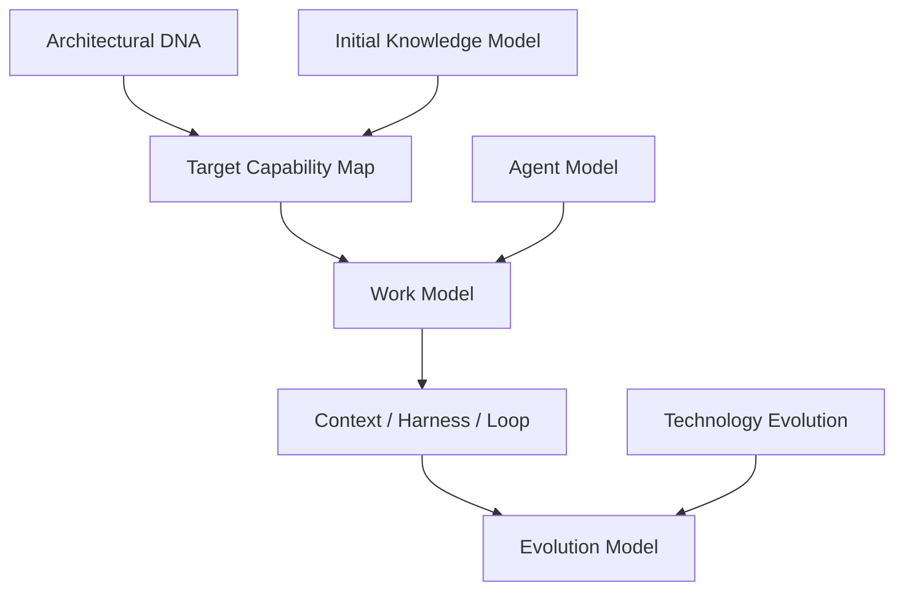
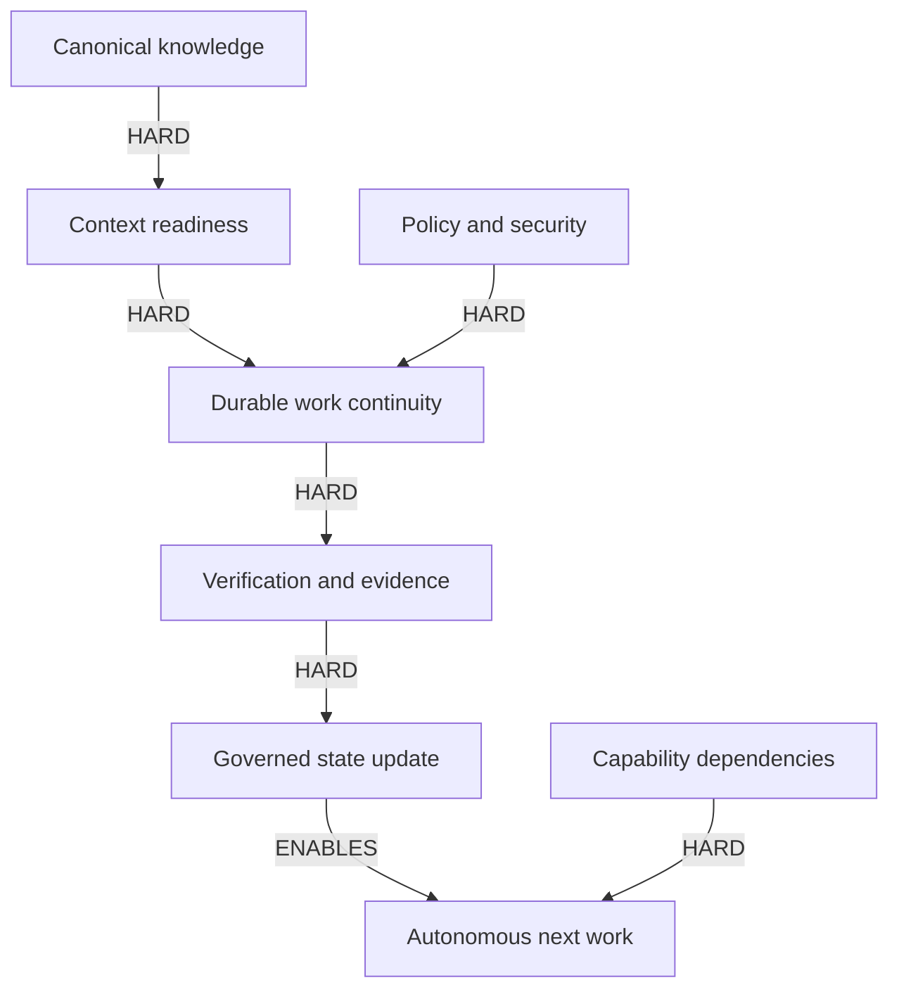

# 69 — Seed Root Views & Model of Models

## Control

- `artifact_id`: `HAPPY-KNOW-69`
- `status`: `DRAFT / DERIVED_ROOT_VIEW`
- `delivery_status`: `PREPARED_NOT_DELIVERED`
- `rule`: compact navigation; detailed authority remains in linked artifacts.

## Model of models

| Model | Question answered | Authority/home | Evolves through |
|---|---|---|---|
| Architectural DNA | what must survive expansion? | doc 55 + decisions | explicit decision/supersession |
| Initial Knowledge Model | how is known information classified now? | doc 56 | model-evolution evidence |
| Target Capability Map | what outcomes exist/are needed? | docs 54/57 | capability state/dependency delta |
| Work Model | how does durable work move? | 0009/0010 + doc 58 | verified operating-model change |
| Context/Harness/Loop | what informs, controls and advances an iteration? | docs 58/69 | evaluation and failure evidence |
| Agent Model | who reasons/acts under which boundaries? | 0015/0016 + bootstrap | source catalog and evaluation |
| Technology Evolution | how do implementations change without freezing tools forever? | doc 59 | lifecycle evidence and ADRs |
| Federated Domain Evolution | how are real domain capabilities learned/aligned without authority transfer? | doc 79 + CAP-3C-009/022 | governed domain evidence, agreement and promotion |
| Knowledge Geometry/Assurance | how do decomposition, relations, proof and iteration compose? | doc 80 + 23/24/58 | standard-fit, model evolution and evidence |

## Capability root view

| Capability | State/maturity | Target | Hard dependencies | Enables | Main homes | Main gap/evolution |
|---|---|---|---|---|---|---|
| `CAP-3C-001` Durable Work Continuity | designed/low | restartable work | canonical state, 0009, evidence | autonomous resume | 0005/0009/0010 | repo/runtime restart test |
| `CAP-3C-002` Loop Engineering | target/early | governed next iteration | work state, evidence, Harness | learning/recovery/evolution | 0018/0019/0029/0037 | BPMN/CMMN/DMN fit |
| `CAP-3C-003` Software Architecture Governance | target/early | logical→module→rule→code conformance | architecture model, repo | drift prevention | 0021/0022/0034 | CALM/Modulith/ArchUnit fit |
| `CAP-3C-004` Canonical Identity & Terminology | partial/early | aliases, temporal identity, correction | provenance, authority, corpus | reliable retrieval/graph | 0007/0024/0025 | registry/evaluation dataset |
| `CAP-3C-005` Search & Retrieval Consistency | partial/early | permission/freshness-aware retrieval | sources, identity, adapters | context readiness | 0005/0008/0023/0032 | benchmark and zero-result evidence |
| `CAP-3C-006` Consistency & Congruence | designed/early | continuously evidenced conformance | baseline, tests, projections | trustworthy state | 0008/0014/0021/0022 | check/receipt catalog |
| `CAP-3C-007` Research Engineering | discovered/early | preregistered, reproducible research | Question, provenance, review | defensible decisions | 0010/0020/0027/0033 | protocol/quality gate |
| `CAP-3C-008` Technology Lifecycle | target/early | evidence-based LTS/obsolescence evolution | research, corporate baseline | safe upgrades | 0018/0019/0030/0032 | institutional sources |
| `CAP-3C-009` Corporate Capability First | invariant/early | discover/reuse before buy/build | catalog, access, cost | thin custom layer | 0011/0017/0032 | corporate catalog |
| `CAP-3C-010..013` Operating/Country/Provider/Reliability | contextual/early | control boundary and country truth | institutional sources | viable deployment | 0013/0027/0031..0033 | SER-007 and workload evidence |
| `CAP-3C-014` Audit Capability | contextual/early | governed audit reuse | policy, data classification, owner | traceability | 0006/0028/0029 + BNK | Pistas y Bitácoras evidence |
| `CAP-3C-015` System Efficiency | target/early | system-boundary optimization | workload/metrics | capacity/cost decisions | 0002/0021/0022/0029 | measurement model |
| `CAP-3C-016..017` Experience & Language | target/early | role-aware, localized, semantically invariant UX | personas, terminology, CLDR | usable/trusted product | 0003/0010/0034/0035 | research and validation |
| `CAP-3C-018..019` Publication & Repository Governance | designed/early | author once/render many; governed boundaries | Git authority, manifest | durable knowledge | 0012/0014/0030/0034 | repo/source evidence |
| `CAP-3C-020` Threat Model Projection | target/early | architecture→threat/control/risk/evidence | canonical architecture, security | CISO views/reassessment | 0027/0028/0033/0034 | standard/format fit |
| `CAP-3C-021` AI Use Case Governance | target/early | baseline/evaluate/govern AI use | data, metrics, policy | responsible ML/agents | 0011/0019/0020/0029 | registry/policy/datasets |
| `CAP-3C-022` Harness Engineering | composed/early | reproducible execution/evaluation | context, tools, tests, telemetry | evidence and migration decisions | all execution Specs | runtime/evaluation design |
| `CAP-3C-023` Context Engineering | designed/partial | purpose-scoped fresh context | sources, identity, retrieval, policy | correct work/answers | 0005/0020/0023 | adapter/runtime evidence |

3E does not add capability IDs. `CAP-3C-009` now includes organizational/domain ownership discovery and federated alignment; `CAP-3C-016` includes Domain UX projections; `CAP-3C-022` includes deterministic-maturity evidence. Their institutional instances remain source-gated.

## Autonomy critical paths

Edge types: `HARD_DEPENDENCY`, `SOFT_DEPENDENCY`, `ENABLER`, `OPTIMIZATION`, `FUTURE_CONDITION`.

No calibrated ranking exists. Candidate paths are compared by unresolved hard dependency, evidence readiness and cross-cutting applicability, not an invented score.

## Work Model root view

Normal path: autonomous continuation. Exception path: irreducible blocker → typed Question → Decision Package → authority → resume trigger.

## Context / Harness / Loop root view

| Concern | Owns | Inputs | Output | Current state | Expansion owner |
|---|---|---|---|---|---|
| Context Engineering | information selection/freshness/authority | task, sources, retrieval, policy | versioned Work Package/Context Manifest | designed/partial | Devin after repo/adapters observed |
| Harness Engineering | execution, checks, evaluation, reproducibility | work package, capabilities, fixtures | result/failure + receipts/evidence | target/partial design | Devin after Tools/Skills/runtime catalog |
| Loop Engineering | next iteration, exit or escalation | objective, result/failure, evidence, state | retry with change, state update, next work, escalation | target/partial design | Devin after standard-fit and operating evidence |
| Task lifecycle | durable work continuity | demand/mission/task | state, delegation, checkpoint/handoff | 0009 v0.2 draft | map/implement/verify post-handoff |
| Question lifecycle | uncertainty and human/research routing | gap/conflict/question | evidence, resolution, rejection/escalation | 0010 draft | extend with research protocol |
| Research/evaluation/recovery | decision support and failure learning | preregistered criteria + observations | finding/recommendation/recovery evidence | discovered | standard/profile expansion |

## Knowledge geometry root view

`TREE` decomposes objectives/capabilities/work; `GRAPH` relates scopes, vectors, owners, dependencies and evidence; `ASSURANCE` links Claim→Argument/Rationale→Evidence; `LOOP` advances state using Harness outcomes. This is a `DERIVED_SYNTHESIS`, not a new framework or Graph-engine choice. See `80_KNOWLEDGE_GEOMETRY_AND_ASSURANCE.md`.

## Federated root view

Architecture AI follows `OBSERVE → MODEL → RECONCILE → PROPOSE → SHADOW/ASSIST → VERIFY → AUTHORIZED_PROMOTION`. It never treats visibility as authority or a local difference as error by default. Post-handoff obligations are enumerated in `82_DEVIN_EXPANSION_OBLIGATIONS.md`.

## Reading rule

This file is a root view. It never overrides the Spec catalog, decision register, evidence, implementation baseline, gaps or source status.

## Acceptance root view — one reality, multiple projections

The existing model-of-models also acts as the platform self-model. A question first resolves intent, audience, authority and required layer/vector/objective, then projects the minimum governed subgraph. Executive, architecture, engineering, security and domain-governance views may differ in depth and emphasis but must retain the same canonical IDs, facts, evidence status, authority and unknowns.

`THE_LLM_EXPLAINS_A_PROJECTION_OF_THE_MODEL; THE_LLM_DOES_NOT_INVENT_THE_MODEL_WHILE_ANSWERING.`

Self-model implementation, View Compiler and Documentation Compiler remain post-handoff expansion work. The acceptance fixture is `FX-L` in document 70.
