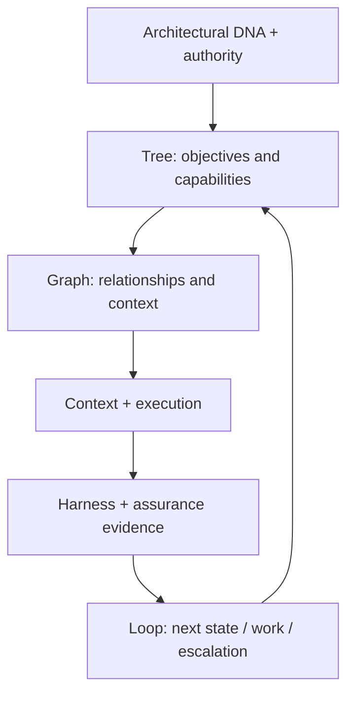

# 80 — Knowledge Geometry, Assurance & Governed Self-Knowledge

## Control

| Campo | Valor |
|---|---|
| `artifact_id` | `HAPPY-KNOW-80` |
| `wave_id` | `P-WAVE-3E-01` |
| `status` | `DRAFT` |
| `delivery_status` | `PREPARED_NOT_DELIVERED` |
| `classification` | `DERIVED_SYNTHESIS` |
| `framework_status` | `NOT_A_NEW_PROPRIETARY_FRAMEWORK` |
| `graph_engine_impact` | `NONE; persistence ADR remains deferred` |

## Propósito

Evitar que una rama de intención desaparezca por no tener todavía una Spec profunda y explicar cómo se complementan los modelos existentes. Esta síntesis no reemplaza el Initial Knowledge Model, Capability Map, Graph model, Traceability, Harness ni Loop Engineering.

## Tree + Graph + Assurance + Loop

| Geometry | Función | Existing roots | No significa |
|---|---|---|---|
| `TREE` | descomponer North Star→Objective→Capability→Subcapability→Requirement→Work | docs 55–58; Spec/requirement catalogs | que la arquitectura real sea un árbol rígido |
| `GRAPH` | relacionar múltiples dominios/vectores, dependencies, owners, sources, decisions y impacts | doc 23; 0024/0025; ontology/Graph sources | selección de motor o verdad canónica automática |
| `ASSURANCE` | justificar claims mediante rationale/argument y evidence | 0004/0020/0022/0024/0029; traceability | que un output convincente sea prueba |
| `LOOP` | operar/evolucionar desde resultados/fallas/evidence hacia el siguiente estado | 0009/0010/0018/0019; docs 58/69 | retry ciego o modificación canónica directa |

Todo está gobernado por `ARCHITECTURAL_DNA + STANDARDS + POLICIES + AUTHORITY + EVIDENCE`.

## Modelo integrado



La secuencia es de razonamiento/navegación, no un pipeline técnico obligatorio.

## Tree — decomposition, no isolation

Una rama conserva stable IDs, parent objective, status, source, target, dependencies y cross-cutting applicability. Crear una subcapability no crea automáticamente una Spec. El tree responde “qué queremos expandir”; el Graph responde “qué más afecta o habilita esta rama”.

Rama mínima:

```yaml
nodeId: <stable-id>
nodeType: OBJECTIVE | CAPABILITY | SUBCAPABILITY | REQUIREMENT | WORK
parentId: <nullable>
status: <typed-status>
sourceEvidence: []
target: <optional>
relatedNodes: []
```

Este ejemplo no es un schema aprobado.

## Graph — relationships and governed self-knowledge

Architecture AI debe poder representar progresivamente:

- qué sabe, source/provenance y authority;
- claims, arguments/rationale y evidence;
- dependencies/enablers/blocks;
- owners, consumers y decision authority;
- contradictions, gaps, supersession y temporality;
- capability→Spec→implementation→test→evidence;
- Agent/Skill/Tool/service→capability;
- country/domain scope y local variants.

Nuevos nodes/relationships/viewpoints pasan por model evolution: limitation/evidence→impact→proposal→compatibility/migration→verification→new version. `CONCEPTUAL_KNOWLEDGE_MODEL` permanece separado de `GRAPH_PERSISTENCE_IMPLEMENTATION`; `AAI-DEC-0018`, `SER-008` y el Graph ADR siguen abiertos.

## Assurance — Claim → Argument → Evidence

Se reutilizan los estados `DISCOVERED → INFERRED → VALIDATED → APPROVED`; no se crea una taxonomía duplicada.

| Elemento | Obligación |
|---|---|
| Claim | afirmación precisa, scoped, versionada y falsable cuando aplique |
| Argument/Rationale | explica por qué la evidencia soporta el claim y sus límites/alternativas |
| Evidence | artefacto/result/measurement/source con provenance, freshness y authority |
| Counterevidence/conflict | permanece visible y bloquea promotion cuando es material |
| Approval | sólo authority aplicable puede convertirlo en verdad institucional |

Ejemplo `PROPOSAL`:

> Claim: “API discovery puede automatizarse”.

Requiere reglas estables, execution history, Harness results, exception coverage, conformance metrics, policy evidence y reproducibility. Sin ello sólo puede existir como hypothesis/candidate. `INFERENCE != INSTITUTIONAL_TRUTH`.

SACM/GSN se evalúan mediante `RO-3E-002`; mencionar el estándar no implica adoption ni custom assurance engine.

## Context + Harness + Loop

| Concern | Pregunta |
|---|---|
| Tree | ¿qué objetivo/capability se expande? |
| Graph | ¿qué relaciones, scope, authority, risks y dependencies importan? |
| Context Engineering | ¿qué información y prohibiciones recibe esta ejecución? |
| Execution | ¿corresponde humano, deterministic, Skill/Tool, agentic o hybrid? |
| Harness Engineering | ¿cómo se observa, prueba, compara, reproduce y controla? |
| Assurance | ¿qué puede afirmarse y con qué evidence/rationale? |
| Loop Engineering | ¿qué state/context/work/retry/escalation sigue? |

Todo loop expandido debe eventualmente declarar objective, trigger, progress, exit, failure classification, recovery, evidence, escalation y next state. 3E preserva el patrón; no desarrolla todos los loops.

## Autonomous expansion traversal

Para una capability poco desarrollada:

1. localizar objetivo/rama y status;
2. cargar DNA/authority/scope aplicables;
3. recorrer dependencies, related capabilities, decisions, Specs, evidence y gaps;
4. revisar standards/frameworks/corporate capabilities y Research Obligations;
5. decidir forma deterministic/agentic/hybrid sin confundir posibilidad con readiness;
6. extender Requirement/Decision/Spec sólo donde haya contrato independiente;
7. generar Work con acceptance y cross-cutting obligations;
8. verificar con Harness y estructurar Claim/Argument/Evidence;
9. proponer StateUpdateDelta/promotion; nunca promover por output del modelo;
10. determinar next eligible work o Decision Package.

## Standards-substitution boundaries

- hierarchical decomposition/planning (`HTN`, Tree/Graph of Thoughts u otros): `RO-3E-001`;
- architecture description/viewpoint fit (`ISO/IEC/IEEE 42010`): `RO-3E-003`;
- assurance case (`SACM/GSN`): `RO-3E-002`;
- AI governance (`NIST AI RMF`, `ISO/IEC 42001`): ampliar `RO-3C-016`;
- process/case/decision execution (`BPMN/CMMN/DMN`): `RO-3C-001`.

Cada investigación debe evaluar applicability, overlap, maturity, license, cost, complexity, interoperability, DNA compatibility y thin-custom-layer opportunity. Ningún nombre de estándar es una decisión.

## Estado

| Elemento | Estado 3E |
|---|---|
| Tree decomposition | `DERIVED_MODEL / DOCUMENTARY` |
| Graph relationship model | `DESIGN_COVERED / ENGINE_ADR_DEFERRED` |
| Assurance model | `DERIVED_EXTENSION / STANDARD_RESEARCH_REQUIRED` |
| Loop model | `TARGET_DEFINED / STANDARD_RESEARCH_REQUIRED` |
| Integrated geometry | `DERIVED_SYNTHESIS / NOT_IMPLEMENTED` |

